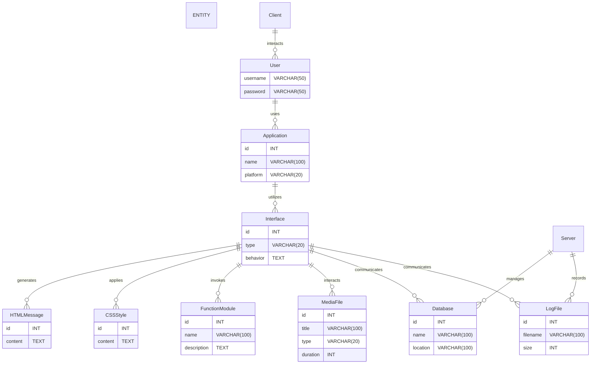
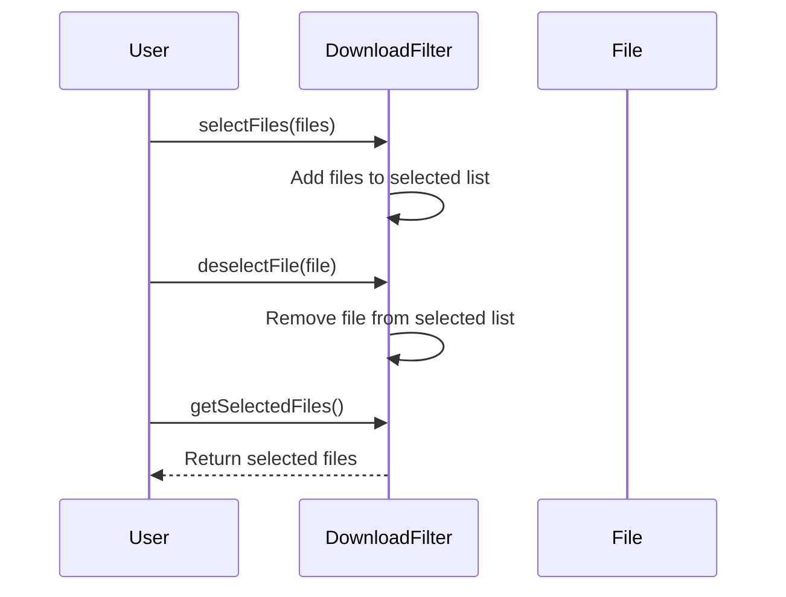

```mermaid
erDiagram
    ENTITY User {
        username VARCHAR(50)
        password VARCHAR(50)
    }
    ENTITY MediaFile {
        id INT
        title VARCHAR(100)
        type VARCHAR(20)
        duration INT
    }
    ENTITY Database {
        id INT
        name VARCHAR(100)
        location VARCHAR(100)
    }
    ENTITY Interface {
        id INT
        type VARCHAR(20)
        behavior TEXT
    }
    ENTITY LogFile {
        id INT
        filename VARCHAR(100)
        size INT
    }
    ENTITY HTMLMessage {
        id INT
        content TEXT
    }
    ENTITY CSSStyle {
        id INT
        content TEXT
    }
    ENTITY FunctionModule {
        id INT
        name VARCHAR(100)
        description TEXT
    }
    ENTITY Application {
        id INT
        name VARCHAR(100)
        platform VARCHAR(20)
    }

    User ||--o{ Application: uses
    Application ||--o{ Interface: utilizes
    Interface ||--o{ HTMLMessage: generates
    Interface ||--o{ CSSStyle: applies
    Interface ||--o{ FunctionModule: invokes
    Interface ||--o{ MediaFile: interacts
    Server ||--o{ Database: manages
    Server ||--o{ LogFile: records
    Client ||--o{ User: interacts

    Interface ||--o{ Database: communicates
    Interface ||--o{ LogFile: communicates
   


```

```mermaid
sequenceDiagram
    participant User
    participant DownloadFilter
    participant File

    User->>DownloadFilter: selectFiles(files)
    DownloadFilter->>DownloadFilter: Add files to selected list
    User->>DownloadFilter: deselectFile(file)
    DownloadFilter->>DownloadFilter: Remove file from selected list
    User->>DownloadFilter: getSelectedFiles()
    DownloadFilter-->>User: Return selected files


```