## $$首页$$

$$项目名称：家庭影音管理系统$$
$$学院：软件学院$$
$$专业班级：20222011$$
$$学号姓名：2022201111王一杭$$
$$学号姓名：2022201120王泽臣$$
$$提交日期：2024年4月18日$$

 ---
## **$$需求规约$$**

### 更改履历

| 序号  |  版本   |   更改时间   | 更改人 | 更改章节 | 状态  |  更改描述  |
| :-: | :---: | :------: | :-: | :--: | :-: | :----: |
|  1  | V1.00 | 2024-4-2 | 王一杭 |      | 新建  |        |
|  2  | V1.01 | 2024-4-8 | 王一杭 |  引言  | 增加  | 书写需求规约 |
|  3  | V2.00 | 2024-4-14 | 王一杭 |  设计报告 | 增加 | 补全所有软件设计内容 |

`状态：新建、增加、修改、删除`

### 目录
1. 引言
	1. 目的 `描述该文档编制的目的`
	2. 背景
	3. 参考资料
	4. 术语
2. 任务概述，目标
3. 需求设定
	1. 一般性需求
	2. 功能性需求
      	- 用例图
      	- 类图
      	- 状态图（时序图）
4. 运行环境规定
	1. 运行环境
	2. 接口(外部系统或设备)
5. 项目非技术需求
---
### 1. 引言
#### 1.1 目的

- 本文档旨在指导开发家庭影音系统，其目标人群为BT/PT且具有NAS（一种私人云盘）的用户，为其提供一个可控制NAS下载、播放、流式播放的跨平台软件。

#### 1.2 背景

- 在如今时代，流媒体平台，包括爱奇艺、腾讯视频、bilibili等国内网站，Youtube、巴哈姆特動畫瘋、niconico、Netflix、Disney+等国外网站（划分由GFW控制）普遍具有视频分辨率较低，码率不足，压制过损等现象，因而使对于影音品质有要求的用户流向BT下载和PT下载。
- NAS设备及服务提供商，例如群晖、威联通等，提供的下载控件（如qbittorrent）和流媒体控件（如jellyfin）多以插件形式安装于NAS中，需要利用浏览器访问NAS管理页面、应用程序管理页面进行控制，不具有用户权限分级策略，且无高保真输出方式。
- MPV作为新时代的全格式播放软件，具有较为优越的解码性能，原生的蓝光机播放水准，以及方便的UI控制接口，开源的程序代码。

#### 1.3 参考资料

1. [Jellyfin Wikipedia](https://zh.wikipedia.org/zh-cn/Jellyfin)
2. [Jellyfin 首页](https://jellyfin.org/)
3. [MPV 首页](https://mpv.io/)

#### 1.4 术语

1. BT：P2P下载技术，使用磁力链接和.torrent文件作为下载链接
2. PT：P2P下载技术，由于BT下载双方过于对等，导致资源丢失和下载方贡献率过低而产生的会员制P2P协议
3. NAS：网络附属存储器，提供SMB服务或者FTP服务的局域网设备，有些服务商提供HTTP协议的上传/下载控件。
4. 流式播放：基于局域网上的远程视频资源本地播放
5. 流媒体平台：互联网视频播放平台
6. GFW：中国互联网防火长城，一种似乎存在的东西。
7. qbittorrent：基于c++开发的开源P2P下载软件，提供WebUI和BT下载程序。
8. jellyfin：基于C#开发的多媒体应用程序套装，提供Web控制和应用程序控制，依靠挂载网络硬盘实现其媒体库。
9. MPV：基于python开发的视频解码程序，提供较为宽泛的视频格式支持，提供较为准确的视频解码

### 2. 任务概述、目标

**任务概述：**
设计和开发一个家庭影音管理系统，旨在提供一个集中管理家庭媒体内容的解决方案。该系统将允许用户从一个统一的界面中控制各种音频和视频设备，包括电视、音响系统、投影仪等，并能够轻松地访问和管理家庭中的各种媒体内容，如音乐、电影、照片等。

**目标：**
1. **集成性和兼容性：** 确保系统可以控制HDMI/DP设备的输出，并提供软件级的识别功能，便于添加新的外部设备。同时提供简单易用的接口，便于外部插件的接入。 
2. **UI设计：** 设计直观且易于使用的界面，使用户能够轻松地浏览影音库，操作系统功能。并且提供宽泛的设备支持，使得UI无论是通过智能手机、平板电脑还是电视屏幕均可以较为直观的被操控。
3. **内容管理和访问：** 提供有效的媒体内容管理功能，包括搜索、分类、标记和组织功能，使用户能够快速找到他们想要的媒体内容。
4. **远程访问：** 实现远程访问功能，使用户可以通过互联网远程管理和控制家庭娱乐系统。
5. **下载服务：** 实现基于RSS订阅服务的自动BT/PT下载，并提供可视化的正则匹配，使得自动下载内容可以被自动标记、分类、归档。

### 3. 需求设定
#### 3.1 一般性需求

1. **性能需求**：本系统响应时间应在1000ms以下，吞吐量和并发数不必过高，仅需要处理一般家庭的情况，并发数在20以内。但考虑到或许本系统可用于学校等场所使用，并发数或许可进一步提高。
2. **可靠性需求**：本系统在出现异常时应记录日志，展式异常页面10s并回退至上一页，同时异常页面应当提供回退按钮。
3. **安全性需求**：出于本系统的局域网内的应用情况，或许没有必要进行过多的安全性要求。
4. **可维护性需求**：本系统应当具有较为清晰的开发文档，代码逻辑应当较为完善的书写在注释中，便于其他开发者基于本系统开发分支。本系统应当以模块的方式进行开发，下载控件、播放控件、管理控件等应当为独立的子模块。
5. **可移植性需求**：本系统的服务端应当被部署于Linux下，使用MySQL作为数据库；本系统的客户端为基于election开发的跨平台软件，其数据库也为MySQL，应当基本适配Android、Linux、Windows、PlayStation、Xbox平台。
6. **易用性需求**：本系统应当具有且仅具有一个设置页面，用于设置各子模块的配置，本系统应当有UI引导按钮，其效果为详细展开/隐藏各按钮的描述信息。
7. **兼容性需求**：本系统应当兼容群晖的管理界面，UnRAID的管理页面，qbittorrent的WebUI，Jellyfin的WebUI，具体表现为调用其接口进行相关管理。同时本系统应当兼容FTP和SMB协议，使用其挂载网络硬盘。

#### 3.2 功能性需求
##### 3.2.1 总用例图
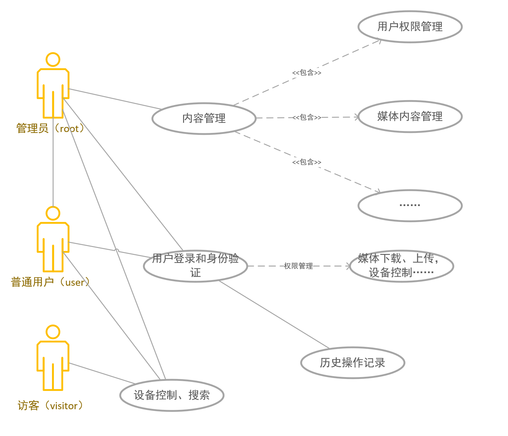

##### 3.2.2 详细需求
###### 3.2.2.1 系统组件
1. **用户登录模块：** 本系统应当提供用户登录页面，并区分管理员和一般用户的权限。
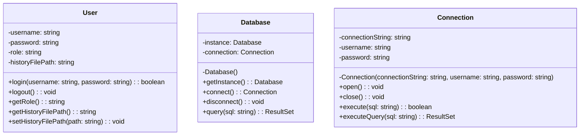
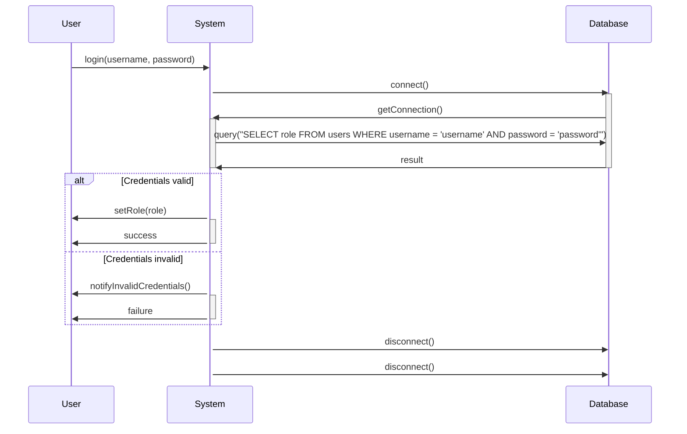
2. **用户历史记录模块：** 本系统应当记录用户的操作历史，并将其日志储存至系统端``./users/UserName/history/watching_history.log``下。同时也应当记录其他用户可进行的操作的行为的历史。
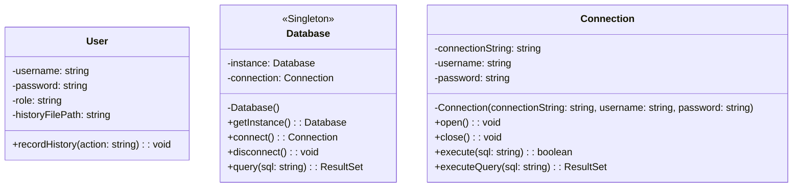
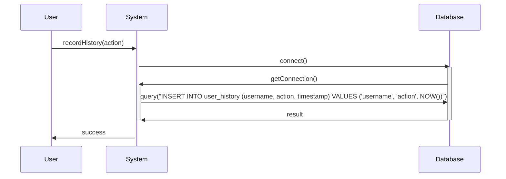
3. **权限管理模块：** 本系统应当对用户可接触到的数据进行分级，例如照片的、视频的年龄分级。同时也应当为管理员用户提供修改用户权限的功能。
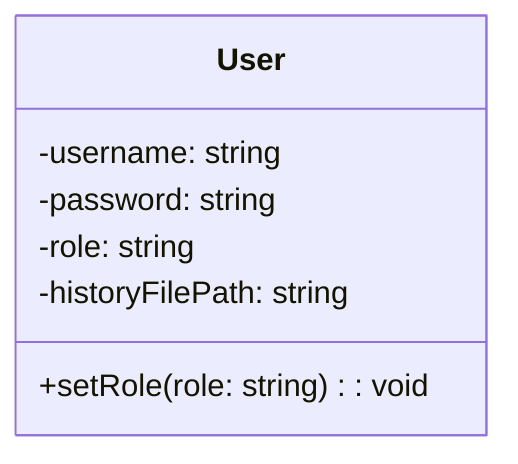
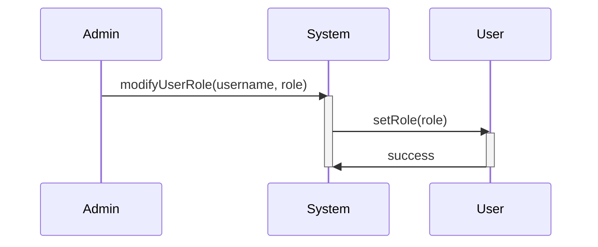
4.  **远程访问模块：** 用户应该能够通过互联网远程访问和控制家庭影音系统，包括远程播放媒体内容等功能。
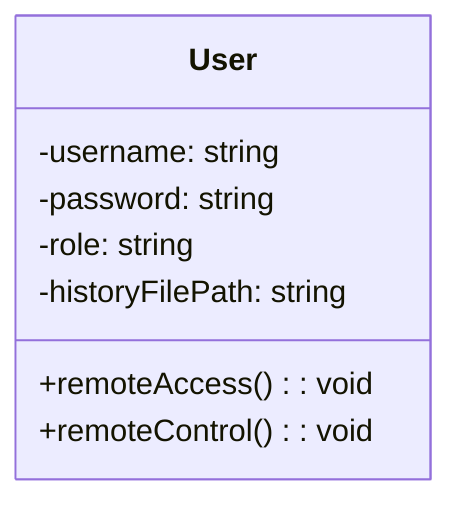
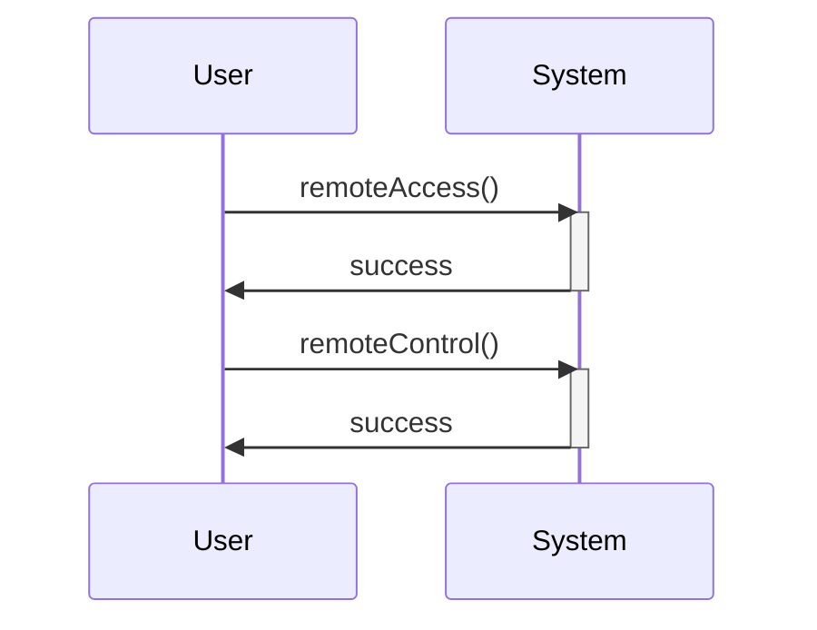
5. **插件接入模块:** 用于接入用户定义的插件，同时使用此模块书写本系统其他功能模块
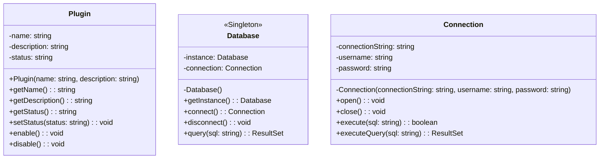
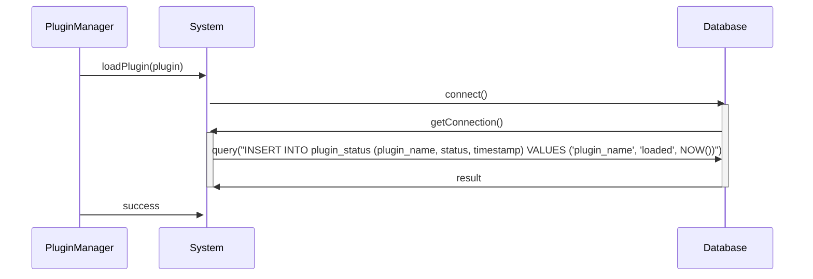
6. **日志书写模块：** 为其它功能模块提供书写日志的接口
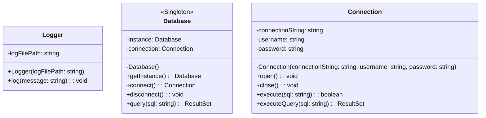
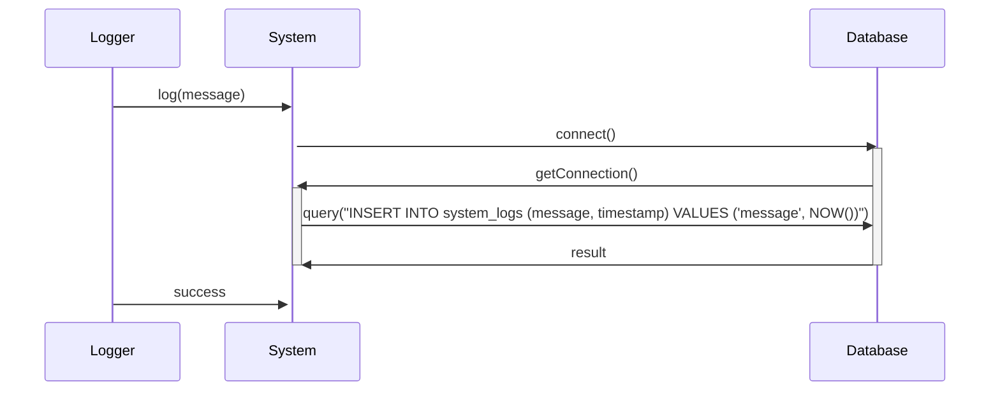
###### 3.2.2.2 内容组件
1. **内容管理模块：** 用户应该能够管理家庭影音系统中的媒体内容，包括上传、删除、编辑、分类和标记等操作。其中，删除操作不对非管理员用户组提供。
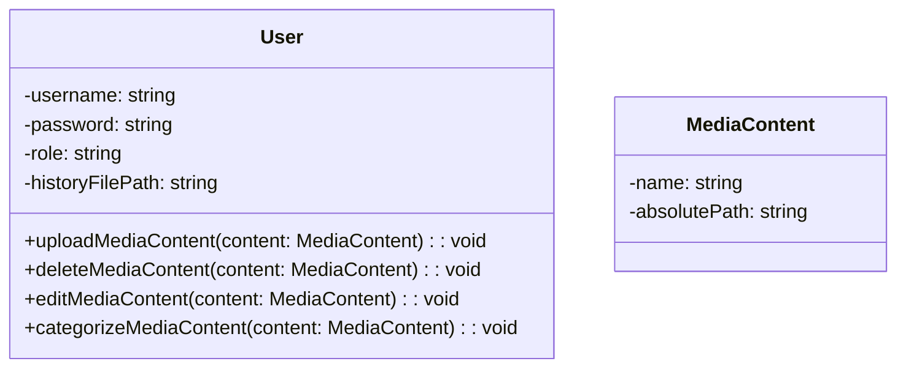
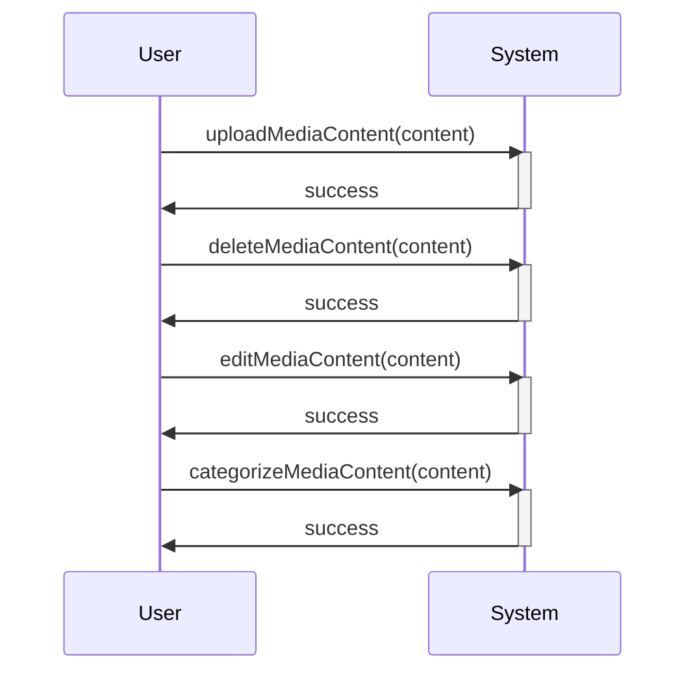
2. **内容标记模块：** 媒体内容应当由数据库进行管理，其中键值为名称，对应参数包括媒体内容的绝对位置等，其标记也应当一同输入数据库，可由用户自行标记，也可由正则匹配文件名标记。
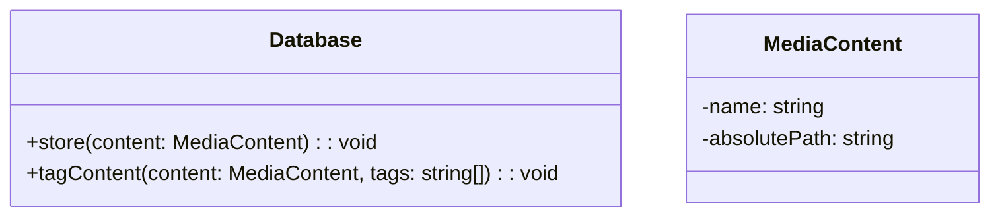
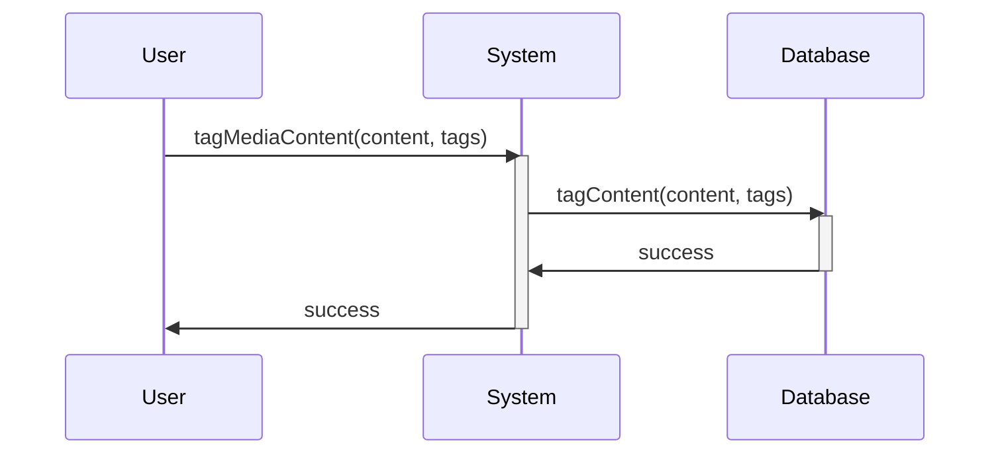
3. **搜索过滤模块：** 用户应该能够通过关键字搜索媒体内容，并能够根据不同的条件进行过滤和排序，以快速找到所需内容。
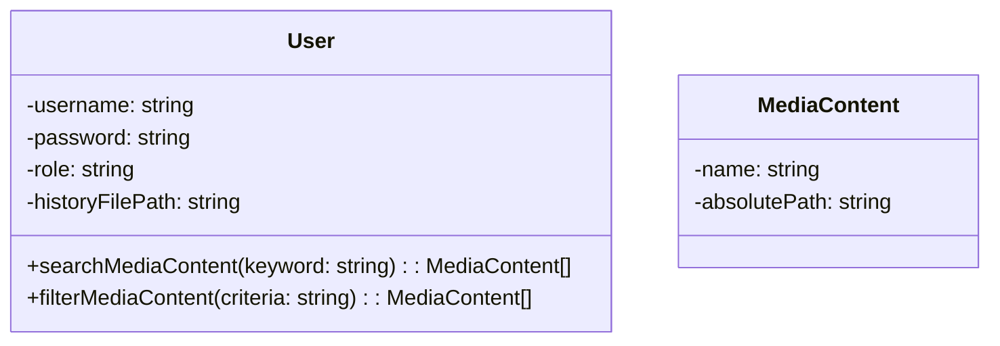
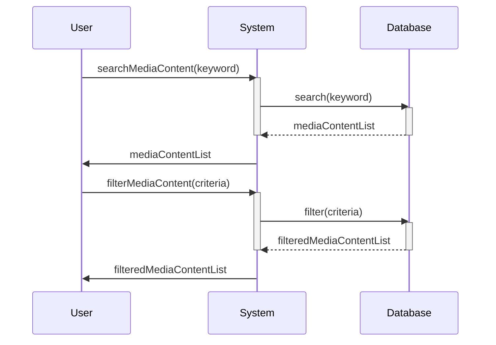
###### 3.2.2.3 播放组件
1. **设备控制模块：** 用户应该能够控制和管理家庭影音系统中的各种设备，如电视、音响系统、投影仪等，包括开关机、音量调节、输入切换等功能。如若可能，应当与智能家居系统联动。
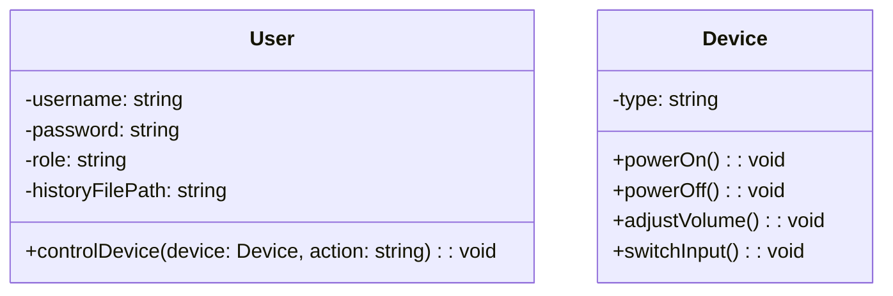
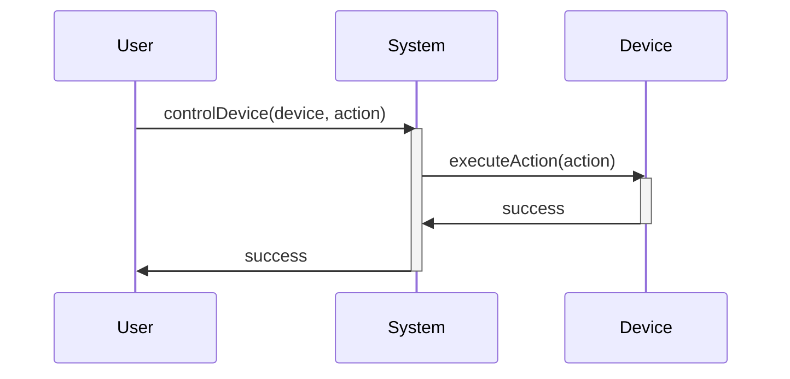
2. **媒体播放模块：** 用户应该能够播放各种媒体内容，如音乐、电影、照片等，并能够控制播放进度、循环模式、播放列表等。本系统应当基于MPV实现
```mermaid
classDiagram
    class User {
        -username: string
        -password: string
        -role: string
        -historyFilePath: string
        +playMediaContent(content: MediaContent): void
        +controlPlayback(action: string): void
    }
    class MediaContent {
        -name: string
        -absolutePath: string
    }

```
```mermaid
sequenceDiagram
    participant User
    participant System

    User ->> System: playMediaContent(content)
    activate System
    System ->> User: success
    deactivate System

    User ->> System: controlPlayback(action)
    activate System
    System ->> User: success
    deactivate System

```
###### 3.2.2.3 下载组件

1. **下载管理模块：** 系统应当提供下载接口，此接口可以由客户端进行调用，将下载内容添加到服务端进行下载；也可以由服务端进行调用，执行RSS订阅服务。
```mermaid
classDiagram
    class System {
        +downloadContent(content: MediaContent): void
        +subscribeRSS(url: string): void
    }
    class MediaContent {
        -name: string
        -absolutePath: string
    }

```
```mermaid
sequenceDiagram
    participant User
    participant System

    User ->> System: downloadContent(content)
    activate System
    System ->> User: success
    deactivate System

    User ->> System: subscribeRSS(url)
    activate System
    System ->> User: success
    deactivate System

```
2. **RSS订阅模块：**
```mermaid
classDiagram
    class RSSReader {
        -feedURL: string
        -lastUpdated: string
        +RSSReader(feedURL: string)
        +update(): void
        +parseRSS(): string
    }
    class Database {
        <<Singleton>>
        -instance: Database
        -connection: Connection
        -Database()
        +getInstance(): Database
        +connect(): Connection
        +disconnect(): void
        +query(sql: string): ResultSet
    }
    class Connection {
        -connectionString: string
        -username: string
        -password: string
        -Connection(connectionString: string, username: string, password: string)
        +open(): void
        +close(): void
        +execute(sql: string): boolean
        +executeQuery(sql: string): ResultSet
    }
```
```mermaid
sequenceDiagram
    participant RSSModule
    participant System
    participant DB as Database

    RSSModule ->> System: update()
    activate System
    System ->> DB: connect()
    activate DB
    DB ->> System: getConnection()
    activate System
    System ->> DB: query("UPDATE rss_feeds SET last_updated = NOW() WHERE feed_url = 'feedURL'")
    DB ->> System: result
    deactivate DB
    deactivate System
    RSSModule ->> System: success
```

3. **下载筛选模块：**
```mermaid
classDiagram
    class DownloadFilter {
        -filterCriteria: string
        +DownloadFilter(filterCriteria: string)
        +applyFilter(): void
    }
    class Database {
        <<Singleton>>
        -instance: Database
        -connection: Connection
        -Database()
        +getInstance(): Database
        +connect(): Connection
        +disconnect(): void
        +query(sql: string): ResultSet
    }
    class Connection {
        -connectionString: string
        -username: string
        -password: string
        -Connection(connectionString: string, username: string, password: string)
        +open(): void
        +close(): void
        +execute(sql: string): boolean
        +executeQuery(sql: string): ResultSet
    }
```
```mermaid
sequenceDiagram
    participant Downloader
    participant System
    participant DB as Database

    Downloader ->> System: applyFilter()
    activate System
    System ->> DB: connect()
    activate DB
    DB ->> System: getConnection()
    activate System
    System ->> DB: query("SELECT * FROM downloads WHERE criteria = 'filterCriteria'")
    DB ->> System: result
    deactivate DB
    deactivate System
    Downloader ->> System: success
```
### 运行环境规定

- **服务端**
  - 系统：NixOS
  - 最低主频：1Ghz
  - 最低运行内存：512MB
  - 最低储存：512MB
- **客户端**
  - 框架：election
  - 运行环境：
    - 移动端：Android
    - PC端：Debian/arch/nixos/Windows11/Windows10
    - 主机端：Xbox/PlayStation
  - 最低主频：3Ghz
  - 最低内存：2GB
  - 最低储存：1GB

### 项目非技术需求

1. **质量需求：** 本项目代码应当具有较高的可维护性，应当被存储于git仓库中，应该定时push到GitHub上方便其他开发者fock此项目

---
## **$$软件设计报告$$**
### 目录

1. 引言
	1. 编制目的
	2. 词汇表
	3. 参考资料
2. 系统开发环境
3. 系统设计思路
4. 功能模块设计
	1. ＊＊＊
5. 数据库设计
	1. 功能说明
	2. 数据表设计
	3. 视图设计
	4. 序列设计

---
### 1. 引言
#### 1.1 编制目的

- 本报告详细完成对家庭影音系统的整体设计，达到指导开发的目的。同时实现和测试人员及用户的沟通
- 本报告面向详细设计人员、开发人员、测试人员及最终用户编写，是了解系统的导航

#### 1.2 词汇表

| 词汇名称 | 词汇含义 | 备注  |
| ---- | ---- | --- |
| 家庭影音系统基本功能 | 家庭影音系统的基本功能需求，包括视频播放、音频播放、网络硬盘挂载、用户界面设计和接入设备识别 |  |
| 通信协议 | 系统中客户端和服务端之间采用的通信协议，如HTTP协议 |  |
| 服务端功能 | 服务端提供的各项功能，包括媒体文件的下载、存储和管理，网络硬盘的挂载，文件上传，用户登录，展示库存文件目录等 |  |
| 客户端功能 | 客户端的功能模块，包括用户交互、媒体文件播放、视频/图片上传等 |  |
| 技术选型 | 选择的技术方案，如election框架、Java、MySQL数据库、Docker等 |  |
| 用户认证体系 | 系统采用的用户认证方式，基于相对于IP的认证体系 |  |
| 数据交换方式 | 客户端和服务端之间数据交换的方式，包括HTTP的get与post请求 |  |
| 视频处理方式 | 系统处理视频的方式，包括裁切为5秒时长的片段 |  |
| 数据库结构设计 | 数据库中媒体文件元数据存储和用户信息存储的设计 |  |
| 客户端样式设计 | 客户端界面的样式设计，包括登录页面样式、主界面样式等 |  |
| 服务端业务逻辑 | 服务端的各项业务逻辑，如用户身份验证、媒体文件上传和管理、代理网络配置等 |  |
| 测试和优化 | 对系统进行全面测试，根据测试结果进行优化以提高系统的性能和用户体验 |  |
| 部署和维护 | 将系统部署到目标环境中，并进行定期维护和更新，包括修复bug、增加新功能等 |  |

#### 1.3 参考资料
1. [Jellyfin Wikipedia](https://zh.wikipedia.org/zh-cn/Jellyfin)
2. [Jellyfin 首页](https://jellyfin.org/)
3. [MPV 首页](https://mpv.io/)
4. [mpv.net-DW](https://github.com/diana7127/mpv.net-DW)
5. [potplayer](https://potplayer.daum.net/)
6. [qbittorrent](https://www.qbittorrent.org/)
7. [PT-下载从入门到养老](https://iecho.cc/2019/01/09/PT-%E4%B8%8B%E8%BD%BD%E4%BB%8E%E5%85%A5%E9%97%A8%E5%88%B0%E5%85%BB%E8%80%81/)
8. [Plex Media Server](https://www.plex.tv/)


### 2. 系统开发环境

- **操作系统：** Windows11、ProxmoxVE with hyprlalnd、Chrome
- **集成开发工具：** Python、IDEA、nodejs
- **编译环境：** Python3.90、gcc13.2.0、JDK 11.0.12
- **Web服务器：** NixOS

### 3. 系统设计思路

1. **需求分析：** 
   - 家庭影音系统的基本功能需求应包括视频、音频播放功能，网络硬盘挂载，用户界面设计，接入设备识别，
   - 服务端和客户端的通信协议可为HTTP协议，通过记录局域网ip-端口访问数据。
   - 服务端与客户端的数据交换应当通过HTTP的get与post执行，分发内容为通用格式数据包，考虑到家用微型机可能无大量转码能力，因而不通过预转码将视频转换为通用播放格式，而采用视频裁切的方式将视频裁切为**5s时长**的片段，进而载入通用数据包进行传输。
2. **架构设计：**
   - 将系统划分为服务端和客户端两个主要模块，服务端负责提供媒体文件的下载、存储和管理，客户端负责与用户交互和播放媒体文件，同时允许用户上传视频/图片。
   - 服务端需要设计存储日志文件的数据库结构，以及提供网络硬盘挂载、下载服务接入、文件上传、用户登录、展示库存文件目录的接口。
   - 客户端需要设计用户界面，包括文件浏览、播放控制等功能。
3. **技术选型：**
   - 客户端选用election框架，便于进行跨平台编译，同时election的基于css的样式可能使用户界面更加美观。
   - 服务端选用Java作为开发语言，使用MySQL数据库，考虑到其稳定性需求和低功耗需求或许可使用docker作为容器服务装载服务端程序，同时便于服务重启，回档。
4. **服务端设计：**
   - 考虑到局域网服务的特性，服务端采用基于**相对于IP**的用户认证体系，避免使用token和cookie进行认证。用户信息应当被存储与数据库中，考虑到稳定性和可靠性需求，本数据库应当被冷备份于网络硬盘之中，与服务端隔离。
   - 服务端提供接口，用于传输各功能分页的HTML格式信息
   - 设计服务端的业务逻辑，包括用户身份验证、媒体文件的上传和管理、网络硬盘的挂载、基于clash-verge的代理网络配置等功能。
   - 设计数据库结构，存储媒体文件的元数据信息，以及用户信息等。
5. **客户端设计：**
   - 登录页面设计：
	   - **样式：** 以用户头像为中心的，背景为白色的页面，用户头像捆绑登录按钮。
	   - **行为：**
		   - **登录按钮：** 向服务端发送get报文，该报文应当提供本机局域网IP和子网掩码，用户名称及密码，密码应当采用标准哈希加密，密文传输。接收服务端验证信息。
		   - **登录行为：** 向服务端发送get报文，请求影视库内容、功能模块，调用主界面绘图函数。
   - **主界面设计：** 视频库页面
	   - **样式：** 以图文详情的列表模式展示影视库内容，渲染影视选择按钮，渲染菜单按钮。菜单按钮位置如下
		   - Android平台：渲染于右下角便于单手点击的位置，点击展开为左上1/4圆的扇形结构菜单，均分为4个选择按钮，依次为
		   - Linux平台/Windows平台：渲染于左上角，以M作为快捷键，选单为列表形式，均提供快捷键。
		   - PS／Xbox平台：打印于右下角`按L1开启菜单`，标准轮盘形式。
	   - **行为：**
    	   - 从服务端接受报文，如遇错误返回值应当重试
    	   - 菜单bottom被触发应当按照其行为调用css绘图，并渲染3个bottom，其行为为调用各分页组件。
    	   - 对于视频列表，应当在bottom被触动后发送get报文，转到视频简介页面。
   - **附属界面设计：**
       1. 影音页面：
          1. 资源简介页面：
             1. 目录树
             2. 音频树
             3. 视频介绍
             4. 作品评论（HTML内嵌页面）
          2. 视频播放界面：
          3. 音乐播放界面：
       2. 下载管理页面：
          1. 下载进度页面
          2. RSS订阅页面
          3. PT下载管理页面
       3. 设置页面：
          1. 功能开关页面
          2. 历史记录/日志查询界面：
          3. 代理配置页面：
       4. 相册展示页面：
6.  **测试和优化：**
   - 对系统进行全面的测试，确保各个功能模块的正常运行和稳定性。
   - 根据测试结果进行优化，提高系统的性能和用户体验。
7.  **部署和维护：**
   - 部署系统到目标环境中，确保系统能够正常运行。
   - 定期对系统进行维护和更新，修复bug，增加新功能，提升系统的可用性和稳定性。

### 4. 功能模块设计（核心）
#### 4.1 下载控件
##### 4.1.1 功能说明

1. **P2P下载：**
	1. BT下载：`考虑到部分NAS系统存在下载插件，因而提供如下两种构建方式`
	      1. 服务端捆绑qbittorrent软件，侦听localhost8080端口，调用qbittorrent的WebUI接口，下载文件到本地，通过qbittorrent的下载文件转移功能，将下载完成后的文件转移到NAS上。
	      2. 服务端记录搭载qbittorrent插件的NAS的局域网IP位置，侦听该IP的特定端口，调用qbittorrent的WebUI接口，直接在网络硬盘上下载内容。
	2. PT下载：`PT下载仍使用qbittorrent软件，因而此处考虑其PT下载管理方面内容`
	      1. 由于pt下载需要密钥，因而应有密钥管理系统
	      2. 考虑可能会接入多个pt站的下载内容，因而其下载应当被标记来源
2. **http下载：** `仍旧考虑调用NAS服务与调用本地服务。`
	1. 调用curl指令，从网络下载内容，上传至NAS中。
	2. 调用sh文件，ssh访问NAS后台，调用curl指令，下载内容。
3. **RSS订阅服务：** `为方便管理，应当提供多个RSS文件配置方式`
	1. 手动审核下载：
		1. 该功能打开时，读取数据库，生成带图列表。
		2. 提供bottom，触发后使得该内容输送至下载模块。
	2. 自动审核机制：
		1. 接收订阅推送，执行匹配代码，匹配成功则推送至下载模块，失败则推送至数据库
		2. 接受订阅管理模块的匹配语句，解释为代码。
	3. RSS订阅管理：
		1. 读取RSS订阅推送的内容，输送至自动审核模块
		2. 管理RSS订阅代码文件
		3. 提供各RSS订阅文件的自动匹配规则编写，输送至自动审核模块。

##### 4.1.2 类、方法设计
##### 4.1.3 类、方法设计
###### 4.1.3.1 DownloadControl类

| 返回值 | 方法名 | 功能  | 参数说明 |     |
| --- | --- | --- | ---- | --- |
|  | startP2PDownload | 启动P2P下载 | 源地址、目标路径 |  |
|  | startHTTPDownload | 启动HTTP下载 | 源地址、目标路径 |  |
|  | startRSSDownload | 启动RSS订阅下载 | 订阅源URL、目标路径 |  |

###### 4.1.3.2 PTDownloadManager类

| 返回值 | 方法名 | 功能  | 参数说明 |     |
| --- | --- | --- | ---- | --- |
|  | managePTDownload | 管理PT下载 | PT站点、下载内容、密钥 |  |

###### 4.1.3.3 RSSManager类

| 返回值 | 方法名 | 功能  | 参数说明 |     |
| --- | --- | --- | ---- | --- |
|  | manualAudit | 手动审核RSS内容 | RSS源URL |  |
|  | automaticAudit | 自动审核RSS内容 | RSS源URL |  |
|  | manageSubscriptions | 管理RSS订阅 | 订阅源URL、匹配规则 |  |
|  | matchCompilation | 预编译正则匹配 | 匹配规则 | | 

###### 4.1.3.4 DataStorage类

| 返回值 | 方法名 | 功能  | 参数说明 |     |
| --- | --- | --- | ---- | --- |
|  | saveDownloadRecord | 保存下载记录 | 下载信息 |  |
|  | retrieveDownloadRecord | 检索下载记录 | 下载条件 |  |

###### 4.1.3.5 PTKeyManager类

| 返回值 | 方法名 | 功能  | 参数说明 |     |
| --- | --- | --- | ---- | --- |
|  | manageKeys | 管理PT下载密钥 | 密钥信息 |  |

##### 4.1.4 相关数据表

下载记录表
PT下载密钥表
RSS订阅管理表

##### 4.1.5 接口设计

1. **startP2PDownload**
   - **功能：** 启动P2P下载任务。
   - **HTTP方法：** POST
   - **URL路径：** /p2p/download
   - **请求参数：**
     - source_url (string): 下载源地址
     - destination_path (string): 下载文件存储路径
   - **响应：**
     - 成功：HTTP状态码 200，返回下载任务ID和状态信息。
     - 失败：HTTP状态码 400，返回错误信息。

2. **startHTTPDownload**
   - **功能：** 启动HTTP下载任务。
   - **HTTP方法：** POST
   - **URL路径：** /http/download
   - **请求参数：**
     - source_url (string): 下载源地址
     - destination_path (string): 下载文件存储路径
   - **响应：**
     - 成功：HTTP状态码 200，返回下载任务ID和状态信息。
     - 失败：HTTP状态码 400，返回错误信息。

3. **startRSSDownload**
   - **功能：** 启动RSS订阅下载任务。
   - **HTTP方法：** POST
   - **URL路径：** /rss/download
   - **请求参数：**
     - feed_url (string): RSS订阅源地址
     - destination_path (string): 下载文件存储路径
   - **响应：**
     - 成功：HTTP状态码 200，返回下载任务ID和状态信息。
     - 失败：HTTP状态码 400，返回错误信息。

4. **managePTDownload**
   - **功能：** 管理PT下载任务。
   - **HTTP方法：** POST
   - **URL路径：** /pt/download
   - **请求参数：**
     - site_name (string): PT站点名称
     - download_content (string): 下载内容
     - key (string): 密钥
   - **响应：**
     - 成功：HTTP状态码 200，返回下载任务ID和状态信息。
     - 失败：HTTP状态码 400，返回错误信息。

5. **manualAudit**
   - **功能：** 手动审核RSS内容。
   - **HTTP方法：** POST
   - **URL路径：** /rss/manual_audit
   - **请求参数：**
     - feed_url (string): RSS订阅源地址
   - **响应：**
     - 成功：HTTP状态码 200，返回审核结果信息。
     - 失败：HTTP状态码 400，返回错误信息。

6. **automaticAudit**
   - **功能：** 自动审核RSS内容。
   - **HTTP方法：** POST
   - **URL路径：** /rss/automatic_audit
   - **请求参数：**
     - feed_url (string): RSS订阅源地址
   - **响应：**
     - 成功：HTTP状态码 200，返回审核结果信息。
     - 失败：HTTP状态码 400，返回错误信息。

7. **manageSubscriptions**
   - **功能：** 管理RSS订阅。
   - **HTTP方法：** POST
   - **URL路径：** /rss/manage_subscriptions
   - **请求参数：**
     - feed_url (string): RSS订阅源地址
     - matching_rules (string): 匹配规则
   - **响应：**
     - 成功：HTTP状态码 200，返回操作结果信息。
     - 失败：HTTP状态码 400，返回错误信息。

#### 4.2 播放控件
##### 4.2.1 功能说明
1. 播放组件
   1. 调用mpv程序，解码并渲染视频及音频。
2. 视频播放控制组件
   1. 基于election的控件，与播放组件交互，控制其行为，控制本地播放。
   2. Android端提供遥控器页面，操作PS/Xbox端播放组件（如果在线）。
   3. 渲染应当与mpv-net-DW分支界面类似。
3. 视频列表展示组件
   1. 应当提供可隐藏的半透明播放列表。
   2. 调用硬盘挂载所提供的接口，或调用数据库接口，以得到目录树结构。
4. 播放日志记录功能
   1. 记录视频播放历史，包括播放时间、播放内容等信息。

##### 4.2.2 类、方法设计
###### 4.2.2.1 VideoPlayer类

该类用于控制视频播放功能。

| 返回值 | 方法名   | 功能            | 参数说明 |
| ------ | -------- | --------------- | -------- |
|        | play()   | 播放视频        |          |
|        | stop()   | 停止播放        |          |

###### 4.2.2.2 VideoControlComponent类

该类用于控制视频播放行为。

| 返回值 | 方法名   | 功能            | 参数说明 |
| ------ | -------- | --------------- | -------- |
|        | controlPlay()   | 控制视频播放行为 |          |
|        | controlPause()  | 控制视频暂停     |          |
|        | controlStop()   | 控制视频停止     |          |

###### 4.2.2.3 VideoListDisplayComponent类

该类用于展示视频列表。

| 返回值 | 方法名   | 功能            | 参数说明 |
| ------ | -------- | --------------- | -------- |
|        | showList()  | 展示视频列表     |          |
|        | hideList()  | 隐藏视频列表     |          |

###### 4.2.2.4 PlayLogRecorder类

该类用于记录视频播放日志。

| 返回值 | 方法名   | 功能            | 参数说明 |
| ------ | -------- | --------------- | -------- |
|        | recordLog()   | 记录播放日志   | 播放内容、播放时间等信息 |

##### 4.2.3 相关数据表

播放日志表

##### 4.2.4 接口设计

1. **playVideo**
   - **功能：** 播放视频。
   - **HTTP方法：** POST
   - **URL路径：** /video/play
   - **请求参数：**
     - video_id (string): 视频ID
   - **响应：**
     - 成功：HTTP状态码 200，返回成功信息。
     - 失败：HTTP状态码 400，返回错误信息。

2. **stopVideo**
   - **功能：** 停止视频播放。
   - **HTTP方法：** POST
   - **URL路径：** /video/stop
   - **请求参数：**
     - video_id (string): 视频ID
   - **响应：**
     - 成功：HTTP状态码 200，返回成功信息。
     - 失败：HTTP状态码 400，返回错误信息。

3. **pauseVideo**
   - **功能：** 暂停视频播放。
   - **HTTP方法：** POST
   - **URL路径：** /video/pause
   - **请求参数：**
     - video_id (string): 视频ID
   - **响应：**
     - 成功：HTTP状态码 200，返回成功信息。
     - 失败：HTTP状态码 400，返回错误信息。

4. **showVideoList**
   - **功能：** 展示视频列表。
   - **HTTP方法：** GET
   - **URL路径：** /video/list
   - **请求参数：** 无
   - **响应：**
     - 成功：HTTP状态码 200，返回视频列表信息。
     - 失败：HTTP状态码 400，返回错误信息。

5. **hideVideoList**
   - **功能：** 隐藏视频列表。
   - **HTTP方法：** POST
   - **URL路径：** /video/list/hide
   - **请求参数：** 无
   - **响应：**
     - 成功：HTTP状态码 200，返回成功信息。
     - 失败：HTTP状态码 400，返回错误信息。

6. **recordPlayLog**
   - **功能：** 记录视频播放日志。
   - **HTTP方法：** POST
   - **URL路径：** /video/log/record
   - **请求参数：**
     - video_id (string): 视频ID
     - play_time (string): 播放时间
   - **响应：**
     - 成功：HTTP状态码 200，返回成功信息。
     - 失败：HTTP状态码 400，返回错误信息。

#### 4.3 代理配置控件
##### 4.3.1 功能说明

提供标准的mihono（clash-verge）内核的代理组件，进而提供网络代理功能，便于访问通过DDNS技术或者VPN技术访问局域网。

1. 控制组件
   1. 提供yaml配置文件读取操作，从网络硬盘读取或调用下载组件从网址下载。
   2. 提供较为丰富的控制组件，包括选择节点、tun模式等等。
2. 自启动组件

##### 4.3.2 类、方法设计
###### 4.3.2.1 ProxyConfig类

该类用于管理代理配置相关的操作。

| 返回值 | 方法名 | 功能  | 参数说明 |
| --- | --- | --- | ---- |
|  | read_config_from_disk | 从本地磁盘读取代理配置 | 文件路径：代理配置文件的路径 |
|  | download_config_from_url | 从指定网址下载代理配置 | URL：代理配置文件的下载链接 |
|  | select_node | 选择特定节点 | 节点名称：要连接的节点的名称 |
|  | set_tun_mode | 设置TUN模式 | 模式：TUN模式的设置参数 |

###### 4.3.2.2 AutoStartComponent类

该类用于控制代理自启动功能。

| 返回值 | 方法名 | 功能  | 参数说明 |
| --- | --- | --- | ---- |
|  | enable_auto_start | 启用代理自启动 | 无 |
|  | disable_auto_start | 禁用代理自启动 | 无 |

##### 4.3.3 相关数据表

ProxyConfig表：该数据表存储代理配置相关的信息。

##### 4.3.4 接口设计

1. **readProxyConfigFromDisk**
   - **功能：** 从本地磁盘读取代理配置文件。
   - **HTTP方法：** POST
   - **URL路径：** /proxy/config/read
   - **请求参数：**
     - file_path (string): 代理配置文件的路径
   - **响应：**
     - 成功：HTTP状态码 200，返回成功信息。
     - 失败：HTTP状态码 400，返回错误信息。

2. **downloadProxyConfigFromURL**
   - **功能：** 从指定网址下载代理配置文件。
   - **HTTP方法：** POST
   - **URL路径：** /proxy/config/download
   - **请求参数：**
     - url (string): 代理配置文件的下载链接
   - **响应：**
     - 成功：HTTP状态码 200，返回成功信息。
     - 失败：HTTP状态码 400，返回错误信息。

3. **selectProxyNode**
   - **功能：** 选择特定节点。
   - **HTTP方法：** POST
   - **URL路径：** /proxy/node/select
   - **请求参数：**
     - node_name (string): 要连接的节点的名称
   - **响应：**
     - 成功：HTTP状态码 200，返回成功信息。
     - 失败：HTTP状态码 400，返回错误信息。

4. **setTUNMode**
   - **功能：** 设置TUN模式。
   - **HTTP方法：** POST
   - **URL路径：** /proxy/mode/set
   - **请求参数：**
     - mode (string): TUN模式的设置参数
   - **响应：**
     - 成功：HTTP状态码 200，返回成功信息。
     - 失败：HTTP状态码 400，返回错误信息。

5. **enableAutoStart**
   - **功能：** 启用代理自启动。
   - **HTTP方法：** POST
   - **URL路径：** /proxy/autostart/enable
   - **请求参数：** 无
   - **响应：**
     - 成功：HTTP状态码 200，返回成功信息。
     - 失败：HTTP状态码 400，返回错误信息。

6. **disableAutoStart**
   - **功能：** 禁用代理自启动。
   - **HTTP方法：** POST
   - **URL路径：** /proxy/autostart/disable
   - **请求参数：** 无
   - **响应：**
     - 成功：HTTP状态码 200，返回成功信息。
     - 失败：HTTP状态码 400，返回错误信息。

#### 4.4 硬盘挂载控件
##### 4.4.1 功能说明

1. 提供网络硬盘挂载功能，支持ftp、SMB等常用协议。
2. 支持上传、下载、只读等功能。
3. 将操作、硬盘目录等记录于数据库中。

##### 4.4.2 类、方法设计
###### 4.4.2.1 DiskMountControl类

该类用于控制硬盘挂载功能。

| 返回值 | 方法名 | 功能  | 参数说明 |     |
| --- | --- | --- | ---- | --- |
|  | mountDisk | 挂载硬盘 | 硬盘地址、协议类型、用户名、密码、目标路径 |  |
|  | unmountDisk | 卸载硬盘 | 目标路径 |  |
|  | setPermissions | 设置硬盘权限 | 目标路径、权限设置 |  |

###### 4.4.2.2 DiskOperationLogger类

该类用于记录硬盘操作日志。

| 返回值 | 方法名 | 功能  | 参数说明 |     |
| --- | --- | --- | ---- | --- |
|  | logOperation | 记录硬盘操作 | 操作类型、目标路径、操作时间 |  |
|  | retrieveLogs | 检索操作日志 | 操作条件、时间范围 |  |

##### 4.4.3 相关数据表

硬盘操作日志表

##### 4.4.4 接口设计

1. **mountDisk**
   - **功能：** 挂载硬盘。
   - **HTTP方法：** POST
   - **URL路径：** /disk/mount
   - **请求参数：**
     - disk_address (string): 硬盘地址
     - protocol (string): 挂载协议类型（ftp、SMB等）
     - username (string): 用户名
     - password (string): 密码
     - target_path (string): 挂载目标路径
   - **响应：**
     - 成功：HTTP状态码 200，返回挂载成功信息。
     - 失败：HTTP状态码 400，返回错误信息。

2. **unmountDisk**
   - **功能：** 卸载硬盘。
   - **HTTP方法：** POST
   - **URL路径：** /disk/unmount
   - **请求参数：**
     - target_path (string): 卸载目标路径
   - **响应：**
     - 成功：HTTP状态码 200，返回卸载成功信息。
     - 失败：HTTP状态码 400，返回错误信息。

3. **setPermissions**
   - **功能：** 设置硬盘权限。
   - **HTTP方法：** POST
   - **URL路径：** /disk/permissions/set
   - **请求参数：**
     - target_path (string): 目标路径
     - permissions (string): 权限设置（只读、读写等）
   - **响应：**
     - 成功：HTTP状态码 200，返回权限设置成功信息。
     - 失败：HTTP状态码 400，返回错误信息。

4. **logOperation**
   - **功能：** 记录硬盘操作日志。
   - **HTTP方法：** POST
   - **URL路径：** /disk/log
   - **请求参数：**
     - operation_type (string): 操作类型（挂载、卸载等）
     - target_path (string): 目标路径
     - operation_time (string): 操作时间
   - **响应：**
     - 成功：HTTP状态码 200，返回日志记录成功信息。
     - 失败：HTTP状态码 400，返回错误信息。

5. **retrieveLogs**
   - **功能：** 检索硬盘操作日志。
   - **HTTP方法：** GET
   - **URL路径：** /disk/logs
   - **请求参数：**
     - operation_type (string): 操作类型（可选）
     - time_range (string): 时间范围（可选）
   - **响应：**
     - 成功：HTTP状态码 200，返回操作日志信息。
     - 失败：HTTP状态码 400，返回错误信息。
  
#### 4.5 日志书写控件
##### 4.5.1 功能说明

1. 提供与数据库交互的接口，记录数据。
2. 捕捉其他控件出现的异常，记录于日志。
3. 接收其他控件输出的日志。

##### 4.5.2 类、方法设计
###### 4.5.2.1 LogWriter类

该类用于记录日志。

| 返回值 | 方法名 | 功能  | 参数说明 |
| --- | --- | --- | ---- |
|  | writeToDatabase | 将日志写入数据库 | 日志内容 |
|  | logException | 记录异常信息 | 异常对象 |
|  | receiveLog | 接收其他控件输出的日志 | 日志内容 |

###### 4.5.2.2 LogDatabaseInterface类

该类用于与数据库交互，实现日志的持久化存储。

| 返回值 | 方法名 | 功能  | 参数说明 |
| --- | --- | --- | ---- |
|  | saveLog | 将日志保存到数据库 | 日志内容 |
|  | retrieveLogs | 检索数据库中的日志 | 检索条件 |

##### 4.5.3 相关数据表

日志表（包括日志ID、时间戳、日志内容等字段）

##### 4.5.4 接口设计

1. **writeToDatabase**
   - **功能：** 将日志写入数据库。
   - **HTTP方法：** POST
   - **URL路径：** /log/write
   - **请求参数：**
     - log_content (string): 日志内容
   - **响应：**
     - 成功：HTTP状态码 200，返回成功信息。
     - 失败：HTTP状态码 400，返回错误信息。

2. **logException**
   - **功能：** 记录异常信息。
   - **HTTP方法：** POST
   - **URL路径：** /log/exception
   - **请求参数：**
     - exception_details (string): 异常信息的详细描述
   - **响应：**
     - 成功：HTTP状态码 200，返回成功信息。
     - 失败：HTTP状态码 400，返回错误信息。

3. **receiveLog**
   - **功能：** 接收其他控件输出的日志。
   - **HTTP方法：** POST
   - **URL路径：** /log/receive
   - **请求参数：**
     - log_content (string): 日志内容
   - **响应：**
     - 成功：HTTP状态码 200，返回成功信息。
     - 失败：HTTP状态码 400，返回错误信息。
### 5. 数据库设计

#### 5.1 功能说明

这个数据库设计旨在支持一个程序的需求，包括下载记录、PT下载密钥、RSS订阅管理、播放日志、代理配置、硬盘操作日志和一般日志的管理。每个表的设计旨在满足特定功能需求，并在整体设计中具有一致性和有效性。

#### 5.2 数据表设计

##### 5.2.1 表名：DownloadRecords，下载记录表

| 字段名 | 类型  | 默认  | 注释  |
| --- | --- | --- | --- |
| record_id | INT | AUTO_INCREMENT | 下载记录的唯一标识符 |
| file_name | VARCHAR(255) |  | 下载文件名 |
| download_date | DATETIME | CURRENT_TIMESTAMP | 下载日期时间 |
| download_status | ENUM('pending', 'completed', 'failed') | 'pending' | 下载状态 |

##### 5.2.2 表名：PTDownloadKeys，PT下载密钥表

| 字段名 | 类型  | 默认  | 注释  |
| --- | --- | --- | --- |
| key_id | INT | AUTO_INCREMENT | 密钥记录的唯一标识符 |
| key_value | VARCHAR(100) |  | PT下载密钥值 |
| description | TEXT |  | 密钥描述信息 |

##### 5.2.3 表名：RSSFeeds，RSS订阅管理表

| 字段名 | 类型  | 默认  | 注释  |
| --- | --- | --- | --- |
| feed_id | INT | AUTO_INCREMENT | 订阅的唯一标识符 |
| feed_url | VARCHAR(255) |  | RSS订阅的URL地址 |
| last_checked | DATETIME |  | 上次检查订阅的时间 |

##### 5.2.4 表名：PlayLogs，播放日志表

| 字段名 | 类型  | 默认  | 注释  |
| --- | --- | --- | --- |
| log_id | INT | AUTO_INCREMENT | 播放日志的唯一标识符 |
| media_name | VARCHAR(255) |  | 媒体文件名 |
| play_date | DATETIME | CURRENT_TIMESTAMP | 播放日期时间 |
| play_duration | INT | 0 | 播放时长（秒） |

##### 5.2.5 表名：ProxyConfig，代理配置表

| 字段名 | 类型  | 默认  | 注释  |
| --- | --- | --- | --- |
| config_id | INT | AUTO_INCREMENT | 配置记录的唯一标识符 |
| proxy_type | ENUM('HTTP', 'HTTPS', 'SOCKS') |  | 代理类型 |
| proxy_host | VARCHAR(100) |  | 代理主机地址 |
| proxy_port | INT |  | 代理端口 |
| username | VARCHAR(50) |  | 认证用户名 |
| password | VARCHAR(50) |  | 认证密码 |

##### 5.2.6 表名：DiskOperationLogs，硬盘操作日志表

| 字段名 | 类型  | 默认  | 注释  |
| --- | --- | --- | --- |
| log_id | INT | AUTO_INCREMENT | 日志的唯一标识符 |
| operation_type | ENUM('copy', 'move', 'delete', 'rename') |  | 操作类型 |
| file_path | VARCHAR(255) |  | 文件路径 |
| operation_date | DATETIME | CURRENT_TIMESTAMP | 操作日期时间 |

##### 5.2.7 表名：GeneralLogs，日志表

| 字段名 | 类型  | 默认  | 注释  |
| --- | --- | --- | --- |
| log_id | INT | AUTO_INCREMENT | 日志的唯一标识符 |
| timestamp | DATETIME | CURRENT_TIMESTAMP | 日志时间戳 |
| log_content | TEXT |  | 日志内容 |
