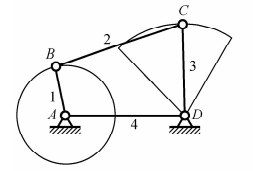
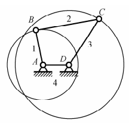
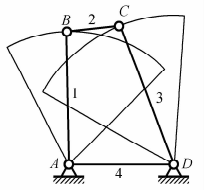
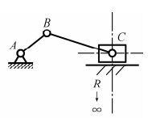
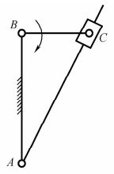
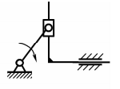
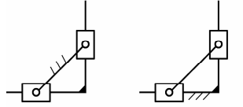
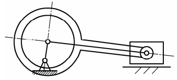

# 机械设计基础B
## 绪论
### 0.1
1. 研究对象：机械（机构和机器的总称）
   1. 机器:
      1. 组成
         1. 原动部分:输入动力源
         2. 传动部分/执行部分:由机构组成 
      2. 分类
         1. 原动机:能量-->机械能
         2. 工作机:机械能-->传动能量/物料/信息
      3. 主体部分由机构组成
         1. 常见:连杆/凸轮/齿轮/轮系/间歇运动机构
         2. 机构只是构件系统,用于传动;机器应当变换/传递能量/物料/信息……
## 平面自由度/速度分析
### 1.1 运动赴/运动链/机构
1. 运动副
   1. 低副:面接触,只能单轴运动(转动/平动)
      1. 转动副(铰链)
      2. 移动副(套杆)
   2. 高副:点/线接触,多轴运动
2. 运动链
   1. 构件通过运动副连接形成的相对可动的系统
   2. 闭式/开式运动链两种,前者连线封闭,后者连线开放
3. 机构
   1. 机架:作为参考坐标系
   2. 原动件:提供动力源,输入构件
   3. 从动件:
### 1.2 平面机构的运动简图
   同工程制图
### 1.3 平面机构的自由度
$$F=3*n(构件数)-2p_L(低副数)-p_H(高副数)$$
注意事项:
1. 复合铰链:记$n-1$个自由度
2. 局部自由度:不影响运动的机构,润滑作用
3. 虚约束:不起约束作用,提供强度加强的机构
### 1.4 速度瞬心法
对于任意两个构件,必然存在一个点,使得两个构件仅绕此点转动.
求法:
1. 定义法
2. 三心定理:做平面运动的三个构件的三个瞬心在同一直线上

## 平面连杆机构
### 2.1 平面四杆机构的基本类型及应用
1. 铰链四杆机构:
   1. 要求:所有运动副都是转动副
   2. 分类：
      1. 曲柄摇杆机构：转换整周转动和往复摆动 
      2. 双曲柄机构：匀速圆周$\rightarrow$变速圆周 
      3. 双摇杆机构：摆动直接转换，幅度变大 
2. 含有一个移动副的四杆机构
   1. 要求：铰链四杆机构的一个转动副变为移动副
   2. 备注：
      1. 实际上只有2根杆（可能）
   3. 分类：
      1. 曲柄滑块机构： 
         1. C过A点则为对心曲柄滑块机构
         2. C不过A点则为偏置曲柄滑块机构
      2. 导杆机构：曲柄滑块机构中的曲柄变为机架（AB固定，BC转动） 
3. 含有两个移动副的四杆机构：
   1. 正弦机构 
   2. 双转块/移块机构 
4. 偏心轮机构： 

|名词|解释|
|:-:|:--|
|曲柄|整周转动的杆子，为整转副。若主动，可能由转动副轴点的动力源驱动|
|摇杆|摆动的杆子|
### 2.2 平面四杆机构的基本特性
1. 有曲柄的条件：
   1. 