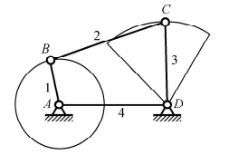
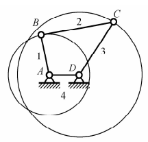

# 机械设计基础B
## 绪论
### 0.1
1. 研究对象：机械（机构和机器的总称）
   1. 机器:
      1. 组成
         1. 原动部分:输入动力源
         2. 传动部分/执行部分:由机构组成 
      2. 分类
         1. 原动机:能量-->机械能
         2. 工作机:机械能-->传动能量/物料/信息
      3. 主体部分由机构组成
         1. 常见:连杆/凸轮/齿轮/轮系/间歇运动机构
         2. 机构只是构件系统,用于传动;机器应当变换/传递能量/物料/信息……
## 平面自由度/速度分析
### 1.1 运动赴/运动链/机构
1. 运动副
   1. 低副:面接触,只能单轴运动(转动/平动)
      1. 转动副(铰链)
      2. 移动副(套杆)
   2. 高副:点/线接触,多轴运动
2. 运动链
   1. 构件通过运动副连接形成的相对可动的系统
   2. 闭式/开式运动链两种,前者连线封闭,后者连线开放
3. 机构
   1. 机架:作为参考坐标系
   2. 原动件:提供动力源,输入构件
   3. 从动件:
### 1.2 平面机构的运动简图
   同工程制图
### 1.3 平面机构的自由度
$$F=3*n(构件数)-2p_L(低副数)-p_H(高副数)$$
注意事项:
1. 复合铰链:记$n-1$个自由度
2. 局部自由度:不影响运动的机构,润滑作用
3. 虚约束:不起约束作用,提供强度加强的机构
### 1.4 速度瞬心法
对于任意两个构件,必然存在一个点,使得两个构件仅绕此点转动.
求法:
1. 定义法
2. 三心定理:做平面运动的三个构件的三个瞬心在同一直线上

## 平面连杆机构
### 2.1 平面四杆机构的基本类型及应用
1. 铰链四杆机构:
   1. 要求:所有运动副都是转动副
   2. 分类：
      1. 曲柄摇杆机构：转换整周转动和往复摆动 
      2. 双曲柄机构：匀速圆周$\rightarrow$变速圆周 
      3. 双摇杆机构：摆动直接转换，幅度变大 
2. 含有一个移动副的四杆机构
   1. 要求：铰链四杆机构的一个转动副变为移动副
   2. 备注：
      1. 实际上只有2根杆（可能）
   3. 分类：
      1. 曲柄滑块机构： 
         1. C过A点则为对心曲柄滑块机构
         2. C不过A点则为偏置曲柄滑块机构
      2. 导杆机构：曲柄滑块机构中的曲柄变为机架（AB固定，BC转动） 
3. 含有两个移动副的四杆机构：
   1. 正弦机构 
   2. 双转块/移块机构 
4. 偏心轮机构： 

   |名词|解释|
   |:-:|:--|
   |曲柄|整周转动的杆子，为整转副。若主动，可能由转动副轴点的动力源驱动|
   |摇杆|摆动的杆子|
   |连杆|传动的杆子,可视为二力杆|
   |机架|固定的杆子|
### 2.2 平面四杆机构的基本特性
1. 有曲柄的条件：

   |机架|最短杆作用|机构类型|
   |---|---|---|
   |最短杆邻边|曲柄|曲柄摇杆机构|
   |最短杆|机架|双曲柄机构|
   |最短杆对边|连杆|双摇杆机构|

   **本机构四杆长度不同**

2. 急回特性和行程速度变化系数

   |字母|名称|计算方法|
   |---|---|---|
   |$\theta$|极位夹角$[0\degree,180\degree)$|$\theta=180\degree\times\frac{K-1}{K+1}$|
   |$\varphi_1$|左极限到右极限的曲柄圆心角|$180\degree + \theta$|
   |$\varphi_2$|右极限到左极限的曲柄圆心角|$180\degree - \theta$|
   |$K$|从动件行程速比变化系数|$K=\frac{\varphi_1}{\varphi_2}=\frac{180\degree+\theta}{180\degree-\theta}$

3. 压力角和传动角
   1. 压力角$\alpha$:连杆在摇杆上的力与速度(切向分力)的夹角,越大则力越有效
   2. 传动角$\gamma$:连杆在摇杆上的力与其径向分力的夹角,越大则传力性能越好
      1. 一般而言,$\gamma_{min}\ge40\degree$,对于高速/大功率机器,应$\ge50\degree$.
      2. 该角是连杆与传动杆的夹角的对顶角,可以采用余弦定理计算其极值
4. 死点:
   1. 并非完全有害,可利用其性质

## 凸轮机构
### 组成、分类、应用
1. 组成
   1. 凸轮
   2. 从动件
   3. 机架
2. 分类
   1. 形状分类
      1. 盘形凸轮:最基本形式
      2. 移动凸轮
      3. 圆柱凸轮
   2. 从动件类型分类
      1. 尖底从动件:适用于传力不大的
      2. 滚子从动件:普遍应用
      3. 平底从动件:用于高速
   3. 从动件运动方式分类
      1. 移动:平动
      2. 摆动:摆动
   4. 接触方式分类
      1. 力锁合凸轮机构:凸轮和从动件间接触通过弹簧力等
      2. 几何锁合:依照几何形状锁合(泰勒三角形)
3. 应用

### 基本概念和参数
1. 基本概念:
   1. 轮廓线:
      1. 理论轮廓线:从动件的实际位移点相对于凸轮的路径
      2. 实际轮廓线:又称工作廓线,凸轮的实际边缘
   2. 偏距圆$e$:回转中心O过接触点与运动导路的偏置距离
   3. 基圆$r_0$:理论轮廓线的最小矢径
2. 运动过程:
   1. 推程:从动件远离回转中心的过程,这过程凸轮转动的角记为推程运动角$\delta_{0}$,从动件位移记为行程$h$
   2. 远休止:从动件的最远路径过程,$\delta_{01}$为远休止角
   3. 回程:从动件靠近回转中心,$\delta_0'$为回程运动角
   4. 近休止:基圆运动过程,$\delta_{02}$为近休止角

### 从动件常用运动规律
1. 等速运动:刚性冲击,速度突变,路程变化为折线,建议修正
2. 等加速运动:柔性冲击,速度变化为折线,适用于中速
3. 简谐运动:柔性冲击,速度/路程/加速度变化为简谐运动曲线,适用于中速
4. 摆线运动:无冲击,加速度为sin/cos函数曲线,适用于高速

### 压力角
   $\Large\tan\alpha=\frac{|\frac{ds}{d\delta}\mp e|}{s+\sqrt{r^2_0-e^2}}$
   
   |符号|意义|
   |---|---|
   |$\alpha$|压力角|
   |$s$|从动件位移|
   |$\delta$|凸轮转角|
   |$e$|偏距|
   |$r$|基圆半径|

## 齿轮机构
### 分类
1. 平面齿轮结构
   1. 直齿圆柱齿轮
   2. 平行轴斜齿圆柱齿轮
   3. 人字齿圆柱齿轮
2. 空间齿轮机构
   1. 圆锥齿轮
   2. 交错轴斜齿轮
   3. 蜗杆结构

### 齿轮啮合基本定理
**在啮合传动的瞬时,两轮齿廓曲线在相应的接触点的公法线必须通过按给定传动比确定的节点**

### 渐开线及渐开线齿廓
1. 渐开线
   1. 定义:**线上固定一点K,使直线沿基圆滚动,该点K的轨迹**
   2. 性质:
      1. 线上法线与基圆相切
      2. 形状由基圆大小确定
      3. 基圆内无渐开线
2. 渐开线齿廓
   1. 

###

## 轮系

## 连接

## 齿轮传动

## 带传动

## 轴

## 滚动轴承