# 1. 引言

## 1.1 概述

1. 组成：
   1. 组成部分视角：
      1. 硬件：主机，通信链路，交换设备，通信设备
      2. 软件：用户使用的软件
      3. 协议：网络传输数据时需要遵守的规范
   2. 工作方式视角：
      1. 边缘部分：用户使用部分
      2. 核心部分：中心网络、连接网络的路由器
   3. 功能组成视角
      1. 通信子网：由传输介质、通信设备、相应的网络协议组成，**传输**
      2. 资源子网：实现资源共享功能的设备及软件，**包装**
2. 功能
   1. 数据通信：传输信息。**最基本和最重要的部分**
   2. 资源共享：使计算机网络分工协作
   3. 分布式处理：将任务分配给网络中其他的计算机系统，**分布式**
   4. 提高可靠性：各台计算机通过网络互为替代机
   5. 负载均衡：均匀分配工作
3. 分类
   1. 分布范围分类：广域网、城域网、局域网、个人区域网
   2. 传输技术分类：
      1. 广播式网络
      2. 点对点网络：每条物理线路连接一对网络
   3. 拓扑结构
      1. 总线型
      2. 星形
      3. 环形
      4. 网状形
   4. 交换技术
      1. 电路交换：发送接收处有专用通路进行数据传输
      2. 报文交换：数据加上地址来进行转发
      3. 分组交换：将报文切分为小块传输
   5. 传输介质
      1. 有线
      2. 无线
4. 性能指标
   1. 时延
      1. 发送时延：第一个到最后一个比特发送完毕所需的时间
      2. 传播时延：一个比特从链路一端到另一端的时间
      3. 处理时延：路由器处理的时延
      4. 排队时延：进入路由器等待处理的时间s
      5. 往返时延：*发送端发送*到*发送端收到接收端确认*的时间
   2. 吞吐量：单位时间通过某个网络/接口的数据量
   3. 速率：主机在数字信道上传送数据的速率，最高数据率称为 **带宽**
   4. 时延带宽积：发送端第一个比特到达终点时，发送端发出了多少比特。$时延带宽积=传播时延\times信道带宽$

## 1.2 结构

1. 分层结构的基本原则:
   1. 每层实现一种相对独立的功能,降低大系统的复杂度。各层之间界面自然清晰，易于理解，**相互交流尽可能少**。
   2. 各层功能的精确定义独立于具体的实现方法，可以采用最合适的技术实现
   3. **保持下层对上层的独立性**，上层单向使用下层的服务
   4. 两个主机通信时，同一层 *逻辑* 上有一条直接信道，显示为不经过下层
2. 协议、接口、服务
   1. 协议：规则的集合
      1. 语法：传输数据的格式。长度、开头等
      2. 语义：要完成的功能。
      3. 同步：各种操作的时序关系。
   2. 接口：相邻两层交换信息的连接点
   3. 服务：下层为紧邻上层提供的功能
      1. 面向连接服务/无连接服务
         1. 面向连接：先建立连接、分配资源、进行数据传输、结束后释放连接
         2. 无连接：通信双方不先建立连接，发送数据时可直接发送
      2. 可靠/不可靠
         1. 可靠：网络具有纠错、检错机制，保证数据正确可靠
         2. 不可靠：网络的正确性、可靠性由应用/用户保证
      3. 应答/无应答
         1. 有应答：接收方收到后给发送方给出相应的应答
         2. 无应答：反之
   4. ***协议和服务在概念上不一致，前者控制对等实体之间的通信规则，后者借助接口从下层向上层提供***
3. ISO/OSI模型
   1. 物理层：
      1. 传输单位：**比特**
      2. 任务：透明的传输比特流
      3. 功能：在物理媒体上为数据端设备透明地传输原始比特流
   2. 数据链路层：
      1. 传输单位：**帧**
      2. 任务：将网络层传来的 **IP数据报** 组装成帧
      3. 功能：组装帧、差错控制、流量控制、传输管理
   3. 网络层：
      1. 传输单位：**数据报**
      2. 任务：把网络层的分组从源端传到目的端
      3. 功能：为分组交换网上的不同主机提供通信服务
   4. 传输层：
      1. 传输单位：**TCP报文段/UDP用户数据报**
      2. 任务：负责主机中两个进程之间的通信
   5. 会话层：允许不同主机上各个进程之间的会话
   6. 表示层：处理两个通信系统中交换信息的表示方式
   7. 应用层：用户界面
4. TCP/IP模型
   1. 应用层
   2. 传输层
   3. 网际层
   4. 网络接口层
5. 五层架构的网络模型：
   1. 应用层
   2. 传输层
   3. 网际层
   4. 数据链路层
   5. 物理层

# 2. 物理层

## 2.1. 通信基础

1. **概念**
   1. 数据:传送信息的实体
   2. 信号:数据的电气/电磁表现
   3. 码元:用固定时长的信号波形表示一个K进制数字,代表不同离散数值的基本波形
   4. 信源:产生/发送数据的源头
   5. 信道:信号传输媒介
   6. 信宿:接受数据的终点
2. **通道:**
   1. 单工通道:单向传输,*一条信道*
   2. 半双工通道:双向传输,但不可同时双向,*两条信道*
   3. 全双工通道:双向传输,可同时双向,*两条信道*
3. **信道的极限容量:** 信道的最高码元传输速率/信道的极限信息传输速率

## 2.2 奈奎斯特定理/香农定理

1. **奈奎斯特定理:**
   1. **规定:** 在 *理想低通* (没有噪声,带宽有限) 的信道中,为了避免码间串扰,*极限码元传输速率*为 **2W波特**
   2. **公式:** $极限数据传输速率 = 2W log_2 V$
      1. W: *理想低通信道的带宽*
      2. V: *每个码元离散电平* 的数目
      3. 单位:b/s
   3. **结论:**
      1. 在任何信道中,码元传输速率是有上限的,若传输速率超过此上限,就会出现更严重的的码间串扰问题,使接收端不可能完全正确识别码元
      2. 信道的频带越**宽**,就可用更**高**的速率进行码元的有效传输
      3. 该准则只给出了**码元传输速率的限制**,未给出**信息传输速率的限制**(未对一个码元可以对应多少个二进制位给出限制)
2. **香农定理:**
   1. **意义:** 给出了 *带宽受限且有高斯白噪声干扰* 的信道的**极限数据传输速率**,当用此速率进行传输时,可以做到不产生误差
   2. **公式:** $信道的极限传输速率 = W log_2(1+\frac{S}{N})$
      1. W:带宽
      2. $\frac{S}{N}$ :信噪比
   3. **结论:**
      1. 信道的带宽越大或信道的信噪比*越大*,信息的极限传输速率*越高*
      2. 对一定的传输带宽和一定的信噪比,信息的传输速率的上限是确定的,只要速率低于极限传输速率,就总有某方法实现无差错的传输

## 2.3 编码与调制

1. **编码:** 数据变换为数字信号的过程
   1. 常见编码: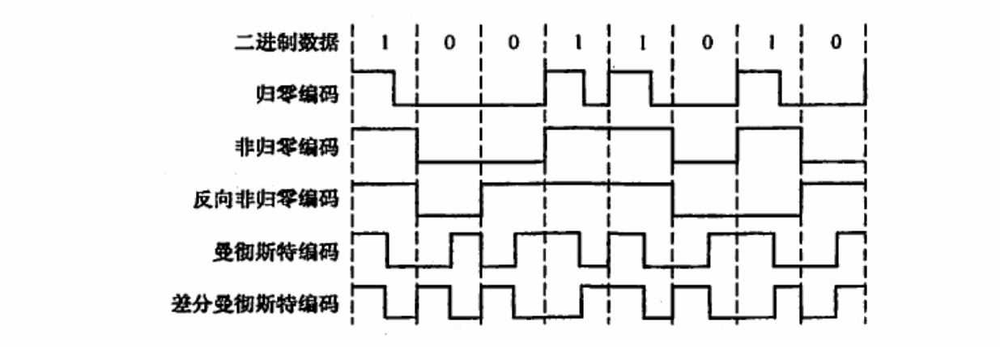
      1. 归零编码: 1先高电平，结束时低电平；0保持低电平
      2. 非归零编码: 1高电平,0低电平
      3. 反向非归零编码: 先正常输出,是1则不变,是0则改变
      4. 曼彻斯特编码:1先高电平后低电平,0先低电平后高电平
      5. 差分曼彻斯特编码:类似于反向非归零编码,(反向曼彻斯特编码)
2. **调制:** 数据变换为模拟信号的过程
   1. 常见的几种调制:
      1. 调幅(ASK 幅移键控):0则平,1则有幅度
      2. 调频(FSK 频移键控):0低频,1高频
      3. 相位调制(PSK 相位键控):0正向,1反向
3. **模拟数据编码为数字信号:**
   1. 采样:模拟信号转换为数字信号时,采样频率必须大于等于最大频率的二倍,才能保证无损
   2. 量化:把电平幅值按照一定的分级标度转换为对应的数字值并取整数
   3. 编码:把量化结果转换为与之对应的二进制编码

## 2.4 电路交换/报文交换/分组交换

1. **电路交换:**
   1. 要求:两个节点之间必须先建立一条*专用的物理通信路径(预先分配带宽)*,直到通信结束后才被释放
   2. 过程:
      1. 建立连接
      2. 数据传输
      3. 连接释放
   3. 优点:
      1. 通信时延小
      2. 有序传输:通信按照顺序传送数据
      3. 没有冲突:所有用户信道不同,不存在争用信道问题
      4. 适用范围广
      5. 实时性强
      6. 控制简单
   4. 缺点:
      1. 建立时间长
      2. 线路独占
      3. 使用效率低
      4. 灵活性差
      5. 难以规格化
   5. 数据传送的特点:比特流直达终点
2. **报文交换:**
   1. 特点:
      1. 数据交换的单位是*报文*, 报文携带目标地址,源地址等信息
      2. 报文交换在交换节点中采用*存储转发*的传输方式
   2. 优点:
      1. 无需建立连接
      2. 动态分配线路
      3. 提高线路的可靠性:如果某条线路的设备故障,则可以换一条
      4. 提高线路利用率
   3. 缺点:
      1. 要经过存储转发过程,时延较高
      2. 需要大量的缓存
3. **分组交换:**
   1. 特点:
      1. 采用存储转发的方式
      2. 限制了每次传输数据块大小的上限,分割数据块
   2. 优点:
      1. 简化了存储管理
      2. 不需要
   3. 缺点
      1. 需要传输额外的信心量,降低了通信的效率
      2. 可能出现失序/丢失/重复分组,需要对其进行重排
   4. 方式
      1. 数据报(无连接)
         1. 过程
            1. 在网络层加上地址等控制信息后形成的数据报
            2. 中间节点储存分组,找到最佳路由,转发
            3. 不同的分组可以走不同的路径,也可以按不同的顺序到达目的节点
         2. 优点:
            1. 不需要建立连接
            2. 不保证可靠性
            3. 需要排队
            4. 对故障的适用能力强
            5. 不独占链路
      2. 虚电路(面向连接)
         1. 特点:将数据报和电路交换的方式结合
         2. 过程:建立一条逻辑上相连的虚电路
            1. 虚电路建立
            2. 数据传输
            3. 虚电路释放
         3. 特点:
            1. 建立和拆除需要时间开销
            2. 提供了可靠的通信功能
            3. 虚电路易遭到破坏
            4. 分组首部只包含*虚电路标识符*

## 2.5 传输介质/物理层设备

1. 传输介质
   1. 双绞线
      1. 屏蔽双绞线
      2. 无屏蔽双绞线
   2. 同轴电缆
      1. 基带同轴电缆
      2. 宽带同轴电缆
   3. 光纤
      1. 单模光纤
      2. 多模光纤
   4. 无线传输介质
      1. 无线电波
      2. 微波/红外线/激光
2. 物理层设备:
   1. 中继器:信号整形、放大、转发
      1. 目的:消除信号的失真和衰减,使信号的波形和强度达到做需要的要求,进而扩大网络传输距离
      2. 原理:信号再生
   2. 集线器(hub):多端口中继器
      1. 若有2/2+个端口输入,则会有冲突,致使数据无效

## 2.6 接口特性

1. 机械特性:接口的形状/尺寸引脚数目,排列,固定和锁定装置
2. 电气特性:接口线缆的各条线上的电压范围
3. 功能特性:某条线上某一电平表示何种意义
4. 过程特性:(规格特性)指明不同功能的各种可能事件的出现顺序

# 3. 数据链路层

## 3.1 功能

1. **为网络层提供服务**:
   1. 无确认的无连接服务:
      1. 源机器发送数据帧不需要先建立链路连接(无连接)
      2. 目的机器收到数据帧*不需发回确认*(无确认)
      3. 对于丢失帧,数据链路层不负责重发而交给上层处理
   2. 有确认的无连接服务
      1. 源机器发送数据帧不需要先建立链路连接(无连接)
      2. 目的机器收到数据帧*需发回确认*(有确认)
      3. 源机器在规定时间内未收到确认则重传
   3. 有确认的面向连接服务
      1. 过程
         1. 建立数据链路
         2. 传输帧
         3. 释放数据链路
      2. 特点:目的机器每一帧都要给出确认,原机器收到确认才发送下一帧
      3. **连接一定要有确认,不存在无确认的面向连接服务**
2. 帧定界、帧同步、透明传输
3. 流量控制
4. 差错控制

## 3.2 组帧

1. **字符计数法**：帧头部使用一个计数字段来表明帧内字符数
   1. 目的：结点的数据链路层收到字节计数值时，就可以知道后面跟随的字节数，从而确定帧结束的位置
   2. 缺点：若帧头部计数字段错误，则整个传输失效。
   3. 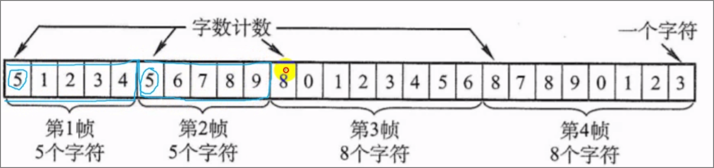
2. **字符填充的首位定界符法**
   1. 概念：使用特定字符来定界一帧的开始与结束，若特殊字符出现与帧之中，则填充转义字符(ESC)
   2. 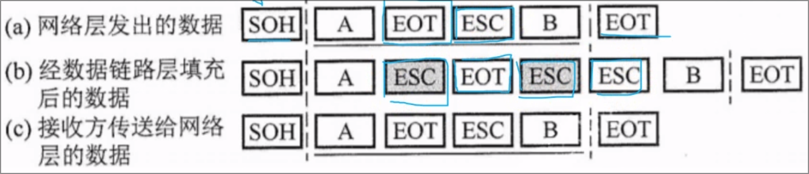
3. **零比特填充的首位标志法**
   1. 方式:用 `01111110`来标志一帧的开始和结束
   2. 行为:
      1. 发送:若信息中有5个连续的1时,则向后面填充一个0
      2. 接受:若信息中有五个连续的1时,则删除后面的一个0
   3. 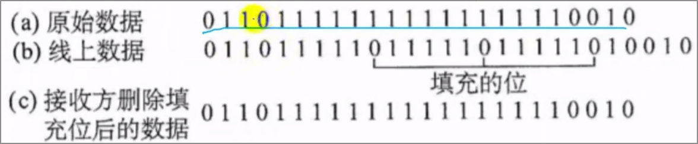
4. **违规编码法**
   1. 使用不属于规定编码的方式来进行标记首位
   2. 比如曼彻斯特编码中,编入一个"高-高电平"数据对

## 3.3 差错控制

1. **检错编码**：
   1. 奇偶校验码
      1. 奇校验码：附加一个校验元后，码长为n的码字中1的个数为*奇*数
      2. 偶校验码：附加一个校验元后，码长为n的码字中1的个数为*偶*数
   2. **循环冗余码**(CRC)：任何一个由二进制数位串组成的代码都可以与一个只含有01两个系数的多项式建立一一对应关系
      1. 取n位位串G(x)，源数据在尾部补n-1个0后，作商取余数，添加与数据尾部
      2. 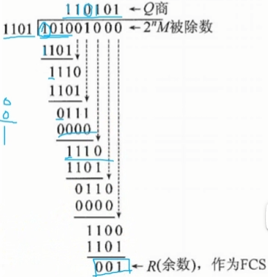
   3. 纠错编码(海明码)
      1. 构成

         1. 设n为有效信息位数，k为校验位的位数，则有$n+k\le2^k-1$
         2. 校验位$P_n$在海明位号为$2^{n-1}$的位置上，其余各位为信息位
      2. 校验位$P_n$：为可由该位组成的所有位的异或积。
      3. 检验码$S_n$：为$P_n$与其组成的所有位的异或积
      4. 出错位：为$S_nS_{n-1}……S_1 $表示的二进制数字

         | 二进制位 | 111     | 110     | 101     | 100     | 011     | 010     | 001     |
         | -------- | ------- | ------- | ------- | ------- | ------- | ------- | ------- |
         | 海明码位 | $H_7$ | $H_6$ | $H_5$ | $H_4$ | $H_3$ | $H_2$ | $H_1$ |
         | 对应位   | $D_4$ | $D_3$ | $D_2$ | $P_3$ | $D_1$ | $P_2$ | $P_1$ |

         - $P_1=D_1\bigoplus D_2\bigoplus D_4$
         - $S_1=P_1\bigoplus D_1\bigoplus D_2\bigoplus D_4$

## 3.4 流量控制/可靠传输机制

1. **滑动窗口机制**:
   1. 停止-等待流量控制基本原理
      1. 发送方每发送一帧,然后等待接收方的应答信号,而后才能发送下一帧
      2. 接收方每接受一帧,然后发送应答信号,表示可接受下一帧
   2. 多帧滑动窗口与后退N帧协议(**GBN**)
      1. 接收方检测出失序的信息帧后,要求发送方重发最后一个正确接收的信息帧之后所有未被确认的帧
   3. 多帧滑动窗口与选择重传协议(**SR**)
      1. 当接收方检测出错时,发送错误应答的,数据链路层继续接受并缓存后续内容
      2. 发送方接收错误应答,重传错误帧
      3. 接收方数据链路层接收重传的帧,将其与超时间隔中部分向上传给网络层

## 3.5 信道划分介质访问控制

1. 信道划分介质访问控制
   1. **频分多路复用**:
      1. 将多路基带信号调制到不同频率载波上,再叠加形成一个复合信号的多路复用技术
   2. **时分多路复用**:
      1. 将一条物理信道按时间分成若干时间片,轮流给多个信号使用
   3. **码分多路复用**:
      1. 采用不同编码来区分各路原始信号
      2. 示例
         1. 假设A发送S,B发送T,注意S/T等长为n
         2. 则信道上为$S-T$
         3. 则A发送$S*(S-T)/n$
      3. **波分多路复用**:使用不同波长的光信号,在一条光纤上传输多组数据
2. 随机访问介质访问控制
   1. **ALOHA协议**

      1. 纯:发送数据时不进行任何检测就发送数据,若接收方不确认,则重发
      2. 时隙:每个时隙开始时才能发送一个帧,减少数据产生冲突的可能性,提高信道的利用率
   2. **CSMA协议**:一个结点发送数据首先侦听信道

      | 信道状态 | 1-坚持       | 非坚持                        | p-坚持                             |
      | -------- | ------------ | ----------------------------- | ---------------------------------- |
      | 空闲     | 立即发送数据 | 立即发送数据                  | 以概率p发送数据,或推迟到下一个时隙 |
      | 忙       | 继续坚持侦听 | 放弃侦听,等一个随机时间再侦听 | 持续侦听,直到信道空闲              |
   3. **CSMA/CD协议**:载波侦听多路访问/碰撞检测

      1. 过程
         1. 先听后发:先获得分组,等到信道空闲边发送
         2. 边听边发:发送时持续监测信道,
         3. 冲突停发:若检测到碰撞,则中止发射,发送拥堵信号给所有用户
         4. 随机重发:执行指数退避算法,等待时间返回检测过程
      2. 在A发送帧后至多经过时间$2\tau$就能知道所发送的帧是否发生碰撞,该往返时间又称争用期
      3. 为了确保发送站可以同时能检测到可能存在的碰撞,则所有数据帧必须大于一个最小帧长
         1. $最小帧长=总线传播时延\times数据传输速率\times2$
         2. 默认时长为$51.2\mu s$
      4. 二进制指数退避算法
         1. 目的:避免两个站点同时再次发送,导致无休止的冲突
         2. 过程:
            1. 确定基本退避时间,一般是$2\tau$
            2. 定义参数k,重传次数,$k=min[重传次数,10]$
            3. 取离散整数集合$[0,1,……,2^k-1]$中随机取出r,等$2r\tau$重传
            4. 当重传16次仍旧不成功,则认为该帧无法正确发出
   4. **CSMA/CA协议**:

      1. 应用于无线局域网
         1. 因其碰撞检测成本过高
         2. 存在无法听到的站点的问题
      2. 过程
         1. 检测数据发送且信道空闲,发送数据帧
         2. 否则执行退避算法,选取随机回退值,当不忙的时候开始退避计时器倒计时,到零则发送
         3. 发送站得到确认.若未得到,则用上一步骤重传
3. 轮询访问介质访问控制
   1. 令牌传递协议:
      1. 用户不能随机发送信息,需要通过集中控制的监控站,以循环的方式轮询每个节点,再决定信道的分配
      2. 一个令牌在各节点间以某个固定次序交换令牌

## 3.6 局域网/广域网

1. **局域网的基本概念和体系结构**
   1. 主要拓扑结构:星形/环形/总线形
   2. 传输介质:双绞线/铜揽
   3. 介质访问控制控制方法
      1. CSMA/CD:总线型局域网
      2. 令牌总线:总线型局域网
      3. 令牌环:环形局域网
   4. 局域网标准:以太网与IEEE 802.3
      1. 特点
         1. 逻辑上采用总线形的拓扑结构,**多点接入技术**
         2. 所有计算机共享一条总线,信息以广播方式发送
         3. 协议主要在数据链路层和物理层
         4. 强调数据传输
      2. 简化通信
         1. 采用无连接的方式,不对数据帧标号,不要求接收方确认
         2. 采用曼彻斯特编码
      3. 网卡:
         1. 又称"网络适配器","网络接口卡"
         2. 介质访问控制地址(MAC):每个网卡的唯一的一个代码,用于控制主机在网络上的通信
         3. 以太网的MAC帧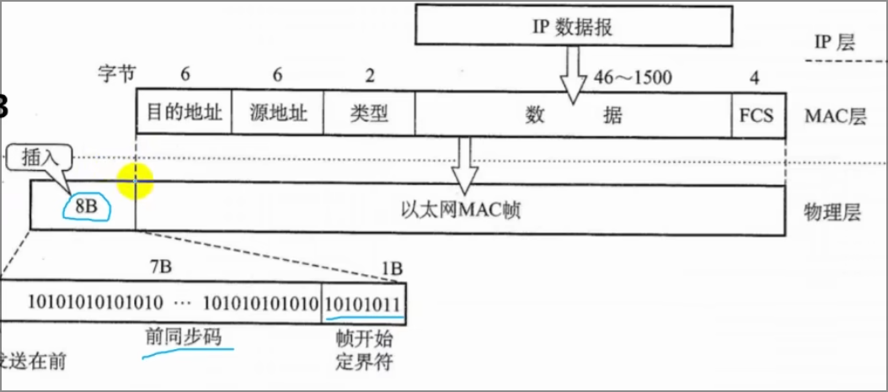
            1. 地址:通常使用6字节(48bit)地址(MAC地址)
            2. 数据:46-1500字节,以太网帧必须满足最小64字节
      4. 高速以太网:
         1. 100BAST-T以太网:全双工方式和半双工方式,在前者下不使用CSMA/CD协议
         2. 吉比特以太网:同上
         3. 10吉比特以太网:只工作在全双工下
2. **广域网**:
   1. 基本概念:覆盖很广的长距离网络,局域网可以通过广域网与另外一个相隔很远的局域网通信
   2. 组成:结点交换机+链路
   3. 特点:
      1. 协议主要在网络层
      2. 强调数据传输
      3. 使用mac地址即可通信
   4. 协议:PPP协议和HDLC协议(数据链路层控制协议)
      1. PPP协议:
         1. 组成:
            1. 链路控制协议(LCP):扩展链路控制协议,用于建立,配置,测试和管理数据链路
            2. 网络控制协议(NCP):配置不同的网络层协议,为网络层协议建立和配置逻辑连接
            3. 封装方法:将IP数据报封装到串行链路的方法,长度受最大传送单元限制
         2. 过程:
            1. 线路处于*静止状态*时,不存在物理层连接
            2. 线路检测到载波型号时,建立物理连接,线路变为*建立状态*
            3. LCP开始选项商定,成功后进入*身份验证状态*
            4. 验证通过,进入*网络状态*
            5. NCP配置网络层,成功后进入*打开状态*,开始数据传输
            6. 数据传输结束后转为*终止状态*,
            7. 载波停止后进入*静止状态*
         3. 特点:
            1. 不使用序号和确认机制,只保证无差错接受(通过硬件进行CRC检验)
            2. 端到端的差错检测由高层协议负责
            3. **面向字节,当信息字段和标志字段出现一致的比特组合,采用字节填充法**
      2. HDLC协议:
         1. 站类型
            1. 主站:控制链路的操作,发出的帧为命令帧
            2. 从站:受控于主站,发出的帧为响应帧
            3. 复合站:可以发出命令帧和响应帧
         2. 数据操作方式
            1. 正常响应状态:
               1. 非平衡结构操作方式
               2. 主站向从站传输数据,从站响应传输.*从站只有收到许可才可响应*
            2. 异步平衡方式:
               1. 平衡结构操作方式
               2. 每个复合站都可以进行对另一站的数据传输
            3. 异步响应方式:
               1. 非平衡结构操作方式
               2. 从站未得到主站许可,也可进行传输
         3. 特点:
            1. 信息帧使用编号和确认机制,能够提供可靠传输
            2. **面向比特**

## 3.7 设备

1. **网桥**:
   1. 作用:
      1. 将多个以太网进行连接,形成覆盖范围更大的以太网.
      2. 原来的每个以太网称为一个网段(LAN)
   2. *工作位置*:链路层MAC子层
      1. 使得以太网各网段成为*隔离开的碰撞域*
   3. 流程
      1. 网桥接受网络1发送的数据帧,检查数据帧中的地址
         1. 若为网络2,则转发给网络2
         2. 若为网络1,则将其丢弃
   4. 基本特点
      1. 具备寻址和路径选择的能力,确定帧的传输方向
      2. 从原网络接受帧,以目的网络的介质访问控制协议向目的网络转发该帧
      3. 可使用不同的物理层,可互联不同类型的局域网
   5. *转发规则*:
      1. 透明网桥(不选择最佳路由)
         1. 原LAN与目的LAN相同,则丢弃
         2. 原LAN与目的LAN不同,则转发
         3. 目的LAN未知,则扩散
         4. **注意:若目的设备未向网桥发送信息,则网桥不知道指向该设备目的路由**
      2. 源路由网桥(选择最佳路由):路由选择由发送帧的源站负责
         1. 未知路径时,源站先发送发现帧
         2. 途中每一个网桥都转发该帧,最终或许有途径到达目的站
         3. 目的站一一应答,并将应答帧原路返回,途中网桥将标志记录在应答帧中
         4. 源路由选择最佳路由
2. **局域网交换机**
   1. 以太网交换机:一个多端口的网桥
      1. 特点:
         1. 每个端口直接与单台主机相连
         2. 为即插即用的设备,转发表通过自学习算法记录
      2. *交换模式*
         1. 直通式:
            1. 作用:只检查帧的目的地址
            2. 特点:
               1. 速度快
               2. 缺乏智能性和安全性
               3. 不支持不同速率端口
         2. 存储转发式
            1. 作用:缓存检验,错了则丢弃
            2. 特点
               1. 可靠性高
               2. 支持不同速率端口转换
               3. 延迟较大

# 4. 网络层

## 4.1 功能

1. **异构网络的互联**:
   1. *概念*:TCP/IP协议中,在网络层采用标准化协议,但是相互连接的网络可以是异构的
   2. 作用:互联后的计算机网络等同于一个虚拟IP网络
2. **路由与转发**
   1. *路由选择*:根据路由选择协议构造出路由表
   2. *分组转发*:将报文段切割为小块,转发到目的设备
3. **拥塞控制**
   1. 确保子网能够承载所达到的流量

## 4.2 路由算法

1. **静态路由算法**(非自适应路由算法):
   1. *概念*:网络管理员手动配置路由信息,若网络拓扑变化或链路状态变化,网络管理员需要手动去修改路由表
   2. 特点:不能及时适应网络状态的变化,但是适用于简单的小型网络
2. **动态路由算法**(自适应路由算法):
   1. *概念*:路由表项是通过相互连接的路由器之间彼此交换信息,按照一定算法优化出来的
   2. 特点:路由信息在一定时间间歇不断更新,以适应不断变化的网络
   3. 类型:
      1. **距离-向量路由算法**:所有节点定期将其路由选择表传送给所有与之相连的节点
         1. 路由选择表内容:
            1. (另一节点)每条路径的目的地
            2. (距离)路径的代价
         2. 行为:
            1. 所有结点都必须参与距离向量交换,以保证路由的有效性和一致性
            2. 所有结点必须监听从其他结点传来的路由选择更新信息
            3. 更新路由选择表:
               1. 被通告一条新的路由时
               2. 发来的路由信息有一条到达某个目的地的路由比之前更短时
      2. **链路状态路由算法**:每个节点都具有完全的网络拓扑信息
         1. 行为:
            1. 主动测试所有邻接结点的状态
            2. 定期将链路状态传播给所有其他结点
         2. 特征:
            1. 向所有路由器发送信息,广度优先发送
            2. 发送的信息是与路由器相邻的所有路由器的*链路状态(距离及拥塞度等)*
            3. 只有链路变化是,才发送信息
      3. **层次路由**:用于连接不同路由选择协议自治系统的协议
         1. 路由选择协议分类:
            1. 内部网关协议(IGP):自治系统内部所使用的路由选择协议,如RIP,OSPF等
            2. 外部网关协议(EGP):又称城间路由选择,用于不同自治系统的路由器交换路由信息,并且负责为分组选择最优的路径,如BGP等

## 4.3 IPV4

1. 格式：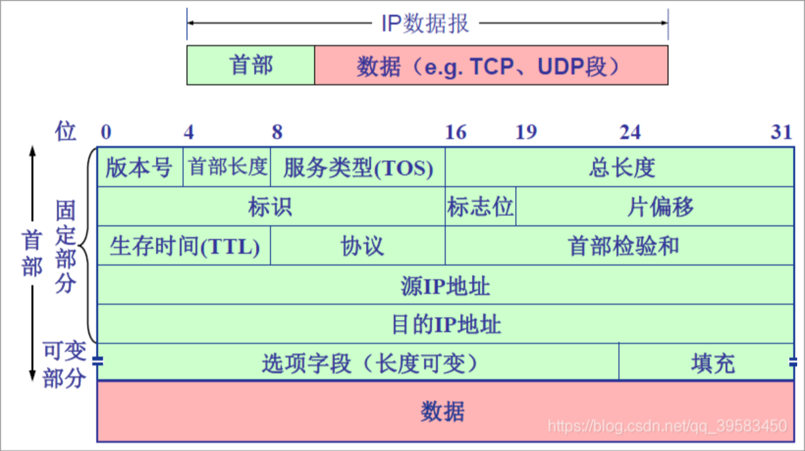
   1. 版本(0-3):ip协议的版本
   2. 首部长度(3-7):
      1. 4位,最大值为15,一般值为5
      2. ip分组的首部长度,以32位(4Byte)为单位
   3. 服务类型(8-15):指示期望获得哪种类型的服务
   4. 总长度(16-31):
      1. 16位,使得ip数据报最长为$2^{16}-1=65535\ Byte$,但是由于MTU限制1500Byte,因此数据报总长度会更短
      2. 指首部和数据之和的长度,单位字节
   5. 标识(32-47):**ip数据报的id**
      1. 每产生一个数据报,标识就加一.
      2. 用于超过MTU时分片重组
   6. 标志(48-50):**ip数据报分片的方式**
      1. 占3位,三个bool位
      2. 最低位为MF,MF=1说明后面还有分片
      3. 中间位为DF,DF=0则允许分片
   7. 分片偏移(51-63):**ip数据报原数据的映射**
      1. 分片在原分组的相对位置
      2. 以8byte为基本单位,每个分片长度一定为8byte的整数倍
2. 网络层转发分组的流程
   1. 从数据报首部提取目的主机的ip地址D,得出网络地址N
   2. 若网络N与路由器直接相连,则交付数据报(直接交付)
   3. 若路由表中有目的地址为D的特定主机路由,则传输至路由表所指明的下一跳路由器
   4. 若路由表中有到达网络N的路由,则传输给路由表所指明的下一跳路由器
   5. 若路由表中存在一个默认路由,则传输给默认路由
   6. 报告转发分组错误
3. ipv4和NAT
   1. ipv4地址
      1. A类:首位为0,后7位为网络号,后24位为主机号
      2. B类:前两位为10,后14位为网络号,后16位为主机号
      3. C类:前三位为110,后21位为网络号,后8位为主机号
      4. D类:前四位为1110
      5. E类:前四位为1111
      6. 注意:
         1. 127.0.0.0为回环地址
         2. 0.0.0.0为本主机
         3. 255.255.255.255受限广播地址
   2. 网络地址转换(NAT):将专用网络地址转换为公用地址,从而对外隐藏内部管理的ip地址
      1. 私有ip地址网段
         1. A类:10.0.0.0-10.255.255.255(1个)
         2. B类:172.16.0.0-172.31.255.255(16个)
         3. C类:192.168.0.0-192.168.255.255(256个)
      2. 使用要求:
         1. 安装NAT软件
         2. NAT路由器至少有一个有效的外部全球地址
      3. 行为:
         1. 本地地址的主机和外界通信时,NAT路由器使用NAT转换表将本地地址转换为全球地址,或反过来
         2. NAT转换表存放着{本地ip地址:端口}到{全球ip地址:端口}的映射,可将多个私有ip地址映射到同一个全球ip地址
   3. 子网划分和子网掩码,CIDR
      1. 子网划分:单位内部将网络划分为子网
         1. 三级ip地址:网络号,子网号,主机号
      2. 子网掩码:
         1. 组成:与ip地址相对应,长32位的二进制串,前为网络地址,全1,后为主机地址,全0
         2. 作用:将主机ip地址与子网掩码进行and运算,可计算该主机所处的子网
         3. 注意:**若将向子网所有主机进行广播,则应当将ip的主机位全部记为16**
      3. 无分类域间路由选择(CIDR)
         1. 特点:消除了传统ABC类地址及划分子网的概念,因此可以更有效的分配ipv4的地址空间
         2. 实际上为子网掩码中1的个数
4. ARP/DCHP/ICMP
   1. IP地址和硬件地址
      1. ip地址:网络层使用的地址,分层次等级
      2. 硬件地址:数据链路层使用的地址,
      3. 注:**ip地址放在ip数据报首部,mac地址放在mac帧首部,数据封装后,ip数据报被分组封装为mac帧,数据链路层看不见数据报分组中的ip地址**
   2. 地址解析协议(ARP)
      1. 行为:主机A向局域网内主机B发送ip数据报
         1. 主机A在ARP高速缓存中查看有无主机B的ip地址
         2. 有,则查询其mac地址,将硬件地址写入mac帧,通过局域网将该mac帧发往此硬件地址
         3. 无,使用mac地址为 **FF-FF-FF-FF-FF-FF** 的帧来封装并广播ARP请求分组,使得局域网内所有主机受到ARP请求
         4. 主机B收到该ARP请求后,向A发出响应ARP分组,其中包含主机B的ip-mac映射.主机A接收后将此映射写入ARP缓存,而后组成mac帧
   3. 动态主机配置协议(DHCP)
      1. 应用层协议,基于UDP
      2. 用于给主机动态分配ip地址,提供即插即用的联网机制
      3. 行为:
         1. 客户机广播*DHCP发现*信息,找到DHCP服务器,以便从服务器获得一个ip地址
         2. 服务器收到*DHCP发现*消息,向网络中广播*DHCP提供*消息,包括客户机ip和相关配置信息
         3. 客户机收到*DHCP提供*消息,若接受相关参数,则广播*DHCP请求*消息向服务器请求提供ip地址
         4. 服务器广播*DHCP确认*消息,将ip地址分配给客户机
   4. 网际控制报文协议(ICMP)
      1. icmp差错报告报文:用于向目标主机/目标主机路径上路由器向源主机报告差错和异常情况
         1. 终点不可达:路由器/主机无法交付数据报,则向源点发送终点不可达报文
         2. 源点抑制:路由器/主机因拥塞而丢弃数据报时,向源点发送源点抑制报文
         3. 时间超过:路由器收到生存时间为0的数据报,则丢弃报文并向源点发送超时报文
         4. 不发送报文的情况:
            1. 禁止套娃:对icmp差错报告报文不再发送icmp差错报文
            2. 对于第一个分片的数据报文后续所有的数据报片都不发送icmp差错报告报文
            3. 对于组播地址的数据报都不发送icmp差错报告报文
      2. icmp询问报文

## 4.4 IPV6

1. 主要特点:
   1. 由32位变为128位
   2. 支持即插即用
   3. 只有源节点才能分片,路径中不能分片
   4. 首部长度必须为8byte的整数倍,而ipv4的首部是4byte的整数倍

## 4.5 路由协议

1. 路由信息协议(RIP)

   1. RIP规定:
      1. 网络中每个路由器都要维护从它自身到其他每个目的网络的距离记录
      2. 距离也称跳数,每过一个路由器直接连接网络的距离为1,每经过一个路由器则距离+1
      3. RIP认为好的路由则通过的路由的数目少,即优先选择跳数少的路径
      4. 最多16跳,多于则不可达
      5. 每30s广播一次RIP路由更新信息,以便自动建立并维护路由表(**动态维护**)
   2. 特点:
      1. 仅和相邻路由器交换信息
      2. 路由器交换自己的路由表
      3. 按照固定时间交换路由表
   3. 为应用层协议,传输层使用UDP
   4. 距离向量算法
      1. 路由表中无目的网络N,则将该项目添加到路由表中
      2. 若有目的网络N,且下一跳路由器地址是X,用收到的项目替换原路由表项目
      3. 若有目的网络N,且下一跳路由器地址不是X,
         1. 若新距离d小于路由表中的距离,则替换
         2. 若大于,则摆烂
      4. 缺点:网络出现故障时,会出现慢收敛现象(需要较长时间才能将此信息传送到所有路由器),使更新过程的收敛时间长
2. 开放最短路径优先(OSPF)协议

   1. 基本特点:
      1. 向自治系统中所有路由器发送信息(洪泛法)
      2. 发送与本路由器相邻的所有路由器的链路状态,但是只是路由器所知道的部分信息
      3. 只有当链路信息发生变化时,路由器才用洪泛法向所有路由器发送此信息,并且更新过程收敛得快
   2. 为网络层的协议,不使用UDP/TCP,而直接使用ip数据报传送(协议字段为89)
   3. 由于各路由器频繁交换链路状态信息,故所有路由器最终都能建立一个链路状态数据库(全网拓扑结构图),利用最短路径算法计算最优路径,进而构建路由表
3. 边界网关协议(BGP)

   1. 特点
      1. 不同自治系统之间交换路由信息的协议,为外部网关协议
      2. 常用于互联网的网关之间
      3. 路由表包含已知路由器的列表,路由器能够达到的地址,到达每个路由器路径的跳数
   2. 目的:
      1. 寻找一条能够达到目的网络且比较好的路由,而非最佳路由
      2. 采用路径向量路由选择协议
   3. 为应用层协议,基于TCP
   4. 每个自治系统的管理员至少要选择一个路由器作为BGP协议的发言人

   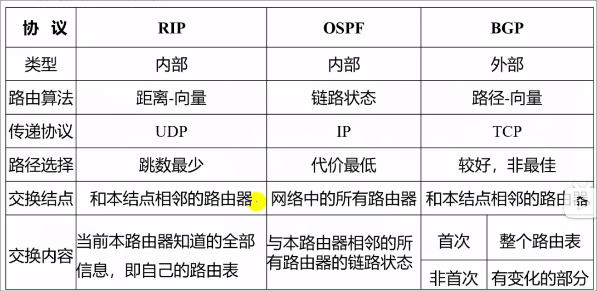

## 4.6 IP组播

1. 概念:有些应用程序要把一个分组发送给多个目的主机,但是令源主机之发送一次,即把单个分组发送给一个组播地址
2. 协议:因特网组管理协议(IGMP)
   1. 主机使用该协议加入组播组
   2. 主机通过该协议向本地网络路由器提出发送给组播组一个分组
   3. 拓展路由器的路由选择和转发
3. 使用D类地址,每个D类ip地址标识一个组播组
4. 分类:
   1. 只在本地局域网上进行硬件组播
   2. 在因特网范围内进行组播,而后将组播数据报在局域网上用硬件组播交付给所有成员
5. 行为:
   1. 某台主机加入新的组播组,该主机向组播组的组播地址发送一个IGMP报文,声明自己要成为该组的成员.本组组播路由器收到IGMP报文,将组成员关系转发给因特网是其他的组播路由器

……

## 4.7 移动IP

……

## 4.8 网络层设备

1. 路由器
   1. 组成：
      1. 物理层
      2. 数据链路层
      3. 网络层
   2. 功能
      1. 路由选择处理机
         1. 路由选择协议
         2. 路由表
      2. 分组处理
         1. 转发表
      3. 交换结构

# 5. 传输层

## 5.1 提供的服务

1. 特点:
   1. 为应用层提供通信服务,为面向通信部分的最高层,用户功能中的最低层
   2. 传输层位于网络层之上,为运行在不同主机上的进程之间提供了逻辑通信(**端到端的通信**);而网络层提供了主机之间的逻辑通信(**点到点的通信**)
   3. 网络层协议不可靠,传输层同样能为应用层提供可靠的服务
2. 功能:
   1. 端到端通信:应用进程之间的逻辑通信
   2. 复用和分用:
      1. 复用:发送方不同的进程都可使用一个传输层协议传送数据
      2. 分用:接收方的传输层剥去报文首部能够把这些数据正确的交付到目的的应用进程
   3. 差错检测:对于报文的首部和数据部分进行差错检测
   4. 提供两种不同的传输协议
      1. 面向连接的TCP
      2. 无连接的UDP
3. 传输层的寻址与端口
   1. 端口的作用:
      1. 让应用层的各种应用进程将其数据通过端口向下交付给传输层
      2. 让传输层知道应当将其报文段中的数据通过端口交付给应用层相应的进程
   2. 端口号:
      1. 熟知端口号(0-1023):指派给了tcp/ip的一些重要应用程序
         1. 20/21: FTP
         2. 22:SSH
         3. 23:TELNET
         4. 25:SMTP
         5. 53:DNS
         6. 69:TFTP
         7. 80:HTTP
         8. 110:POP3
         9. 161:SNMP
      2. 登记端口号(1024-49151):供其他应用使用
      3. 短暂端口号(49152-65535):在客户进程运行时才动态的选择
4. 传输层的寻址与端口
   1. 套接字:端口号拼接到ip地址即构成套接字
5. 面向连接服务/无连接服务
   1. 面向连接：先建立连接、分配资源、进行数据传输、结束后释放连接
   2. 无连接：通信双方不先建立连接，发送数据时可直接发送,令数据自生自灭

## 5.2 UDP协议

1. 传输层向上提供一条不可靠的逻辑信道
2. 概述:
   1. 添加两个基本服务:
      1. 复用和分用
      2. 差错检测
   2. 使用UDP时,应用程序几乎直接和ip打交道
3. 优点
   1. 无需建立连接,没有引入建立连接的时延
   2. 无连接状态,顾不需要维护连接
   3. 分组首部开销小,tcp为20B,udp为8B
   4. 应用层能更好的控制要发送的数据和发送时间:udp无拥塞控制,因此此网络的拥塞不会影响主机的发送效率
   5. 支持一对一,一对多,多对一,多对多的通信
4. 数据报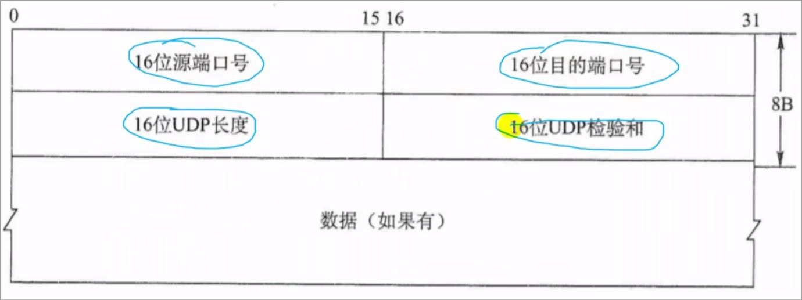
5. UDP校验
   1. UDP会添加一段12B伪首部用于数据校验等,但是该伪首部不向下向上传输

## 5.3 TCP协议

1. 特点:
   1. 面向连接的传输层协议
   2. 每TCP连接只能有两个端点,(点对点)
   3. 提供可靠的交付服务,包装传输的数据 **无差错,不丢失,不重复,有序**
   4. 提供全双工通信,双方可同时收发,两端均设有发送/接收缓存
   5. 面向字节流:交互是一次一个数据块,但是最终将其视为一串无结构的字节流
2. 报文段
   1. 作用:
      1. 运载数据
      2. 建立连接/释放连接/应答
   2. 结构:整个TCP报文段作为IP数据报的数据部分封装在IP数据报中
      1. 首部:前20B固定,后面根据需要增加4B*n的长度
      2. 数据
   3. 格式: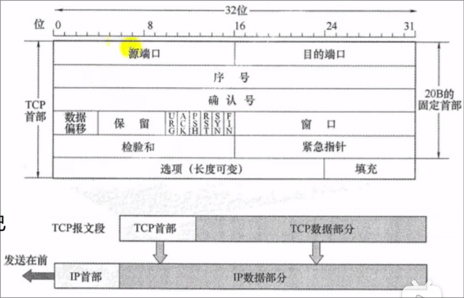
      1. 序号seq(32位):TCP数据部分第一个报文段的序号
      2. 确认号ack(32位):期望收到对方下一个报文段第一个数据字节的序号
      3. 数据偏移(4位):单位为32位(4byte),TCP报文段的首部的长度
      4. 急位URG:为1时为紧急数据
      5. 确认位ACK:为1时确认号字段有效,建立连接后本值应当为1
      6. 推送位PSH:尽快交给应用进程而非等待缓存填满
      7. 同步位SYN:表明这是一个连接请求/连接接收报
      8. 终止位FIN:表明此报文段发送方的数据已发送完毕,并释放该连接
3. TCP连接管理:
   1. 三个阶段:连接建立\数据传送\连接释放
   2. 方式:采用客户/服务器的方式,主动发起建立的应用进程成为客户,被动等待连接建立的应用进程称为服务器
   3. 过程:
      1. 建立(三次握手)
         1. 客户机发送请求报文段:
            1. SYN=1,
            2. 选择初始序号seq=x
            3. (SYN报文段不能携带数据,*但是要消耗掉一个序号*)
         2. 服务器接收请求报文段,同意则建立连接,发回确认报文,并为该连接分配缓存和变量
            1. SYN=1
            2. ACK=1
            3. 确认号ack=x+1
            4. 初始序号scq=y
            5. (确认报文段不能携带数据,*但是也要消耗掉一个序号*)
         3. 客户机收到确认报文段,发出确认,分配缓存和变量
            1. ACK=1
            2. ack=y+1
            3. seq=x+1
            4. (若不携带数据,*可以不消耗序号*)
      2. 释放:(四次挥手)
         1. 客户机发送释放报文段,停止发送数据,主动关闭TCP连接
            1. FIN=1
            2. seq=u=之前传输的最后一个字节的序号+1
            3. (不携带数据也消耗一个序号)
         2. 服务器收到后发出确认(客户机向服务器链路关闭)
            1. ack=u+1
            2. seq=w=之前传输的最后一个字节的序号+1
         3. 服务器发送释放报文段
            1. FIN=1
            2. ACK=1
            3. seq=w
            4. ack=u+1
         4. 客户机发送确认,等待2MSL关闭,服务器接收后关闭
            1. ACK=1
            2. seq=u+1
            3. ack=w+1
4. 可靠传输
   1. 序号:使用序号字段来保证数据能有序提交给应用层
   2. 确认:
      1. 首部确认号为期望收到对方的下一个报文段的数据的第一个字节的序号
      2. 默认使用累计确认:TCP只确认数据流中的至第一个丢失字节为止的字节
   3. 重传:
      1. 超时:每发送一个报文段,就设置一次计时器,到期未收到确认则重传
      2. 冗余ACK(冗余确认):当发送端接收到3次相同的ACK报文时,在计时器结束后重传该报文
5. 流量控制
   1. 传输层和数据链路层的流量控制的区别:
      1. 传输层定义端到端用户之间的流量控制,滑动窗口协议的窗口大小不能动态变化
      2. 数据链路层定义两个中间的相邻节点的流量控制,滑动窗口可以动态变化
6. 拥塞控制
   1. 拥塞控制和流量控制的区别:
      1. 拥塞控制:
         1. 概念:防止过多的数据注入网络,保证网络中的路由器或链路不致过载
         2. 目的:为了让网络能够承受现有的网络负荷
         3. 为全局性的过程
         4. 
      2. 流量控制
         1. 目的:抑制发送端发送数据的速率,以便使接收端来得及接收
         2. 为端到端的问题
   2. 方式:
      1. 接收窗口rwnd:
         1. 接收方根据缓存大小所许诺的最新窗口值
         2. 反应接收方的容量.由接收方根据其TCP报文首部的窗口字段通知发送方
      2. 拥塞窗口cwnd:
         1. 发送方根据自己估算的网络拥塞程度而设置的窗口值
         2. 反应网络的当前容量
            1. 网络拥塞则减小一点,减少注入网络的分组数
            2. 网络不拥塞则增大一点,多发几个分组
      3. $发送窗口的上限值=min[rwnd,cwnd]$
   3. 控制算法:
      1. 慢开始和拥塞避免
         1. 慢开始算法:
            1. 先令cwnd=1(一个最大报文段长度MSS),每收到一个新报文的确定则加1
            2. 注意:先为指数倍增加,当增加量达到门限值(sstresh)时,改用拥塞避免算法
         2. 拥塞避免算法
            1. 每经过一个往返时延则cwnd+1,而非加倍
         3. 处理算法
            1. 拥塞时,sstresh=cwnd/2
            2. cwnd=1
            3. 慢开始算法
      2. 快重传:发送方连续收到三个重复的ACK报文时,直接重传对方尚未收到的报文段,而不必等待重传计时器超时
      3. 快恢复:发送方连续收到三个冗余ACK(重复确认)时,把慢开始门限ssthresh设置为此时发送方cwnd的一半,将cwnd设置为ssthresh,开始执行拥塞避免算法

# 6. 应用层

## 6.1 网络应用模型

1. 客户/服务器模型(C/S)
   1. 工作流程
      1. 服务器处于接受请求的状态
      2. 客户机发出请求,等待接受结果
      3. 服务器收到请求,分析,进行处理,得到结果并发送给客户
   2. 特征:客户是服务的请求方,服务器是服务提供
2. P2P模型:
   1. 网络上的传输内容不再被保存在中心服务器上,
   2. 每个节点同时具有上传/下载
   3. 每个节点的权利和义务大体是对等的

## 6.2 域名系统(DNS)

1. 层次域名空间:
   1. 因特网采用层次树状结构命名方法
      1. 任何一个主机/路由器,都有一个唯一的层次结构名称(域名)
   2. 域名标号:
      1. 不区分大小写
      2. 不能用"-"以外的标点
      3. 每个标号不超过63个字符,完整域名不超过255个字符
      4. 越高级的域名写在越右边
2. 域名服务器:
   1. 设计:
      1. 域名系统为联机的分布式数据库系统
      2. 采用客户/服务器模型
      3. 解析服务由服务器上程序完成
   2. 类型:
      1. 根域名服务器
      2. 顶级域名服务器(com/org/……)
      3. 权域名服务器
      4. 本地域名服务器
3. 域名解析：
   1. 类型
      1. 正向解析：将网址映射为ip
      2. 反向解析：将ip映射为网址
   2. 方式：通过本机DNS客户端构造一个DNS请求报文，以UDP数据报的方式发往本地域名服务器
      1. 递归查询：以 设备-本地-根-顶级-权限 顺序，递归查询
         1. `ask():if 0: return ask(next);`
      2. 递归-迭代查询：先问根,没有则再问顶级

## 6.3 文件传输协议(FTP)

1. 特点:
   1. 提供交互式的访问
   2. 允许客户指明文件类型和格式
   3. 允许文件具有存取权限
2. 工作方式:
   1. 客户/服务器的工作方式
   2. 采用TCP进行传输
   3. 可同时为多个客户进程提供服务
3. 组成:
   1. 主进程:负责接收新的请求
   2. 从属进程:负责处理单个请求
4. 行为:
   1. 开放21端口:客户进程连接端口
   2. 等待客户进程发送连接请求
   3. 启动从属进程来处理客户进程发来的请求.
   4. 主进程和从属进程并行执行,从属进程处理结束后即终止
   5. 回到等待状态,等待其他客户请求
5. 端口:
   1. 20:数据连接端口,
      1. 主动模式:服务端连接到客户端端口
      2. 被动模式:客户端连接到服务端20端口
   2. 21:控制连接端口,传输控制信息,会话期间始终打开

## 6.4 电子邮件

1. 组成结构:
   1. 用户代理:用户与电子邮件系统的接口,提供给用户一个接口来发送/接收邮件
   2. 邮件服务器:发送和接收邮件,并且向发信人报告邮件传输情况
   3. 电子邮件使用的协议:
      1. 邮件发送协议:用于用户代理向邮件服务器之间发送邮件(如SMTP[Push方式])
         1. SMTP:
            1. tcp连接,25端口
            2. 过程
               1. 连接建立:SMTP客户端每隔一段时间对邮件缓存扫描一次,若有邮件则建立TCP连接
               2. 邮件传送:从MAIL命令开始传送邮件
               3. 连接释放:邮件发送完毕发送QUIT命令,服务端返回221(服务关闭),表示同意释放
      2. 邮件读取协议:用于用户代理从邮件服务器读取邮件(如POP3[Pull方式])
         1. POP3:
            1. tcp连接,110端口
            2. 工作方式:
               1. 下载并保留
               2. 下载并删除
2. 过程:
   1. 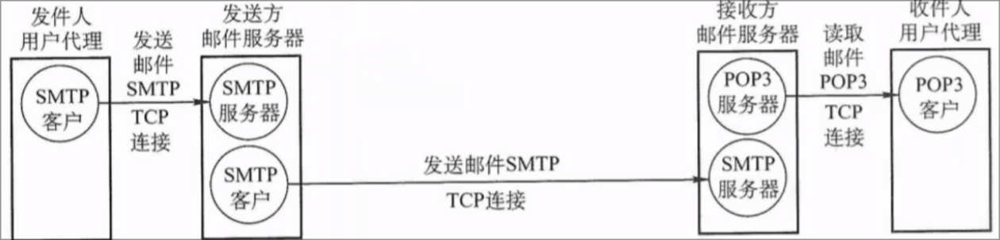

## 6.5 万维网

1. 一个分布式\联机式的信息储存空间
2. 内核
   1. 统一资源定位符(URL):用来标识万维网上的各种文档,同时使得每个文档在整个万维网范围里具有唯一的标识符
   2. 超文本传输协议(HTTP):应用层协议,使用TCP连接进行可靠传输
      1. 操作过程:
         1. 浏览器分析链接指向页面的URL
         2. 发送DNS请求解析IP地址
         3. DNS返回ip地址
         4. 浏览器与服务器建立tcp连接
         5. 浏览器发出HTTP请求
         6. 服务器通过HTTP响应将文件发送给浏览器
         7. 释放TCP连接
         8. 浏览器解释文件
      2. 特点:
         1. 数据可靠传输
         2. HTTP无状态,用户第二次访问同一个服务器的页面时服务器响应与第一次访问时相同
         3. 可以使用非持久/持久的连接
            1. 对于非持久连接,每一个都建立一个TCP连接
            2. 持久连接:服务器发送响应后仍保持这条连接,使得同一用户和该服务仍旧在此连接上传输后续的HTTP请求
   3. 超文本标记语言(HTML):文档结构的标记语言
3. 工作流程:
   1. 使用URL与服务器建立连接,并发送浏览请求
   2. 服务器将URL转换为文件路径.返回信息给浏览器
   3. 通信完成,关闭连接
