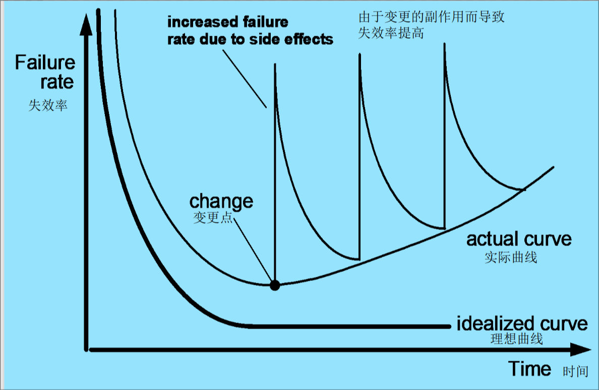

# 第一章：软件的本质

## 1.1 软件工程的定义

1. 计算机有软件和硬件组成
   1. 硬件：是看得見、摸得着的电子机械设备块。
   2. 软件：是依附在硬件上面的**程序、数据和文档的集合**，是指挥控制计算机系统(包括硬件和软件)工作的神经思维中枢。
2. 概念：软件=程序+数据+文档(软件描述信息)
   1. 程序:按照事先设计的功能和性能要求编写的指令序列
   2. 数据:使程序能正常操纵信息的数据结构
      1. 数据=初始化数据+测试数据
   3. 文档:与程序开发/维护/使用有关的图文材料
      1. 文档=用户文档+开发文档+管理文档
         1. 用户文档:
            1. 用户手册
            2. 操作手册
            3. 维护修改建议报告
            4. 软件需求规格说明书
         2. 开发文档
            1. 软件需求规格说明书
            2. 数据说明要求
            3. 概要设计说明书
            4. 详细设计说明书
            5. 可行性研究报告
            6. 项目开发计划
         3. 管理文档
            1. 项目开发文档
            2. 测试计划
            3. 测试报告
            4. 开发进度报告
      2. 也称文件,通常指的是一些记录的数据和数据媒体,具有固定不变的形式,可被人和计算机阅读
         1. 软件文档的编制(documentation)在软件开发工作中占有突出的地位和相当的工作量
         2. 高效率、高质量地开发、分发、管理和维护文档对于转让、变更、修正、扩充和使用文档，对于充分发挥软件产品的效益有着重要意义。
      3. 作用:
         1. 桥梁作用:连结计算机,用户,软将管理/开发/维护人员
3. 软件的特性
   1. 软件是设计开发的,不是生产制造的
      1. 软件不会引入质量问题,或者其质量问题易于纠正
      2. 人员和工作成果的对应关系完全不同
      3. 构建方法不同,软件的成本主要在与开发设计
   2. 软件不会磨损,
      1. 但是因为软件的变更会出现退化
      2. 软件的缺陷暗示了设计的缺陷或者在设计转化到及其可执行代码过程中产生的错误
      3. 
   3. 工业向着基于构建的构造模式发展,但是大多数软件仍旧根据实际的客户需求定制
4. 应用领域
   1. 系统软件
   2. 应用软件
   3. 工程/科学软件(模拟软件)
   4. 嵌入式软件
   5. 产品线软件
   6. web应用
   7. 人工智能
5. 遗留软件:软件必然面临着变更
   1. 软件必须进行适应性调整,以满足新的计算环境和计算的需求
   2. 软件必须升级来实现新的商业需求
   3. 软件必须拓展使得其具有更现代化的系统和数据库的互操作能力
   4. 软件必须改进以适应新的网络环境
6. webapp的特性
   1. 网络密集
   2. 并发性
   3. 无法预知的负载量
   4. 性能
   5. 可用性
   6. 数据驱动
   7. 内容敏感
   8. 持续演化
   9. 即时性
   10. 安全性
   11. 美观性
7. 软件危机:
   1. 表征
      1. 开发成本和进度的估计常常不准确
      2. 用户对"已完成"的系统不满意
      3. 软件质量不佳
      4. 软件可维护程度低
      5. 软件没有适当的文档资料
      6. 软件的成本不断提高
      7. 软件开发生产率的提高赶不上硬件的发展和人们需求的增长
   2. 本质:计算机软件开发和维护过程所遇到的一系列严重问题
      1. 主要矛盾:
         1. 如何开发软件,以满足不断增长且不断复杂的需求
         2. 如何维护数量不断膨胀的软件产品
   3. 优秀的软件:
      1. 功能正确,性能优良
      2. 容易看懂,容易使用,容易修改/扩充
8. 软件工程:
   1. 若干事实:
      1. 在制定方案之前要理解问题
      2. 设计师一项关键的软件工程活动
      3. 软件必须保证高质量
      4. 软件需要具备可维护性
   2. 定义:
      1. 种子定义:软件工程是建立和使用一套合理的工程原则,以便经济的获得可靠的,可实际运行的软件
         1. 本定义忽略了度量和测量的重要性和有效的软件过程的重要性
      2. IEEE定义:
         1. 系统化的,规范的,可量化的方法用于软件的开发,运行和维护.
         2. 将工程化的方法应用于软件的开发/运行/维护
         3. 对以上所述的方法的研究
      3. 
